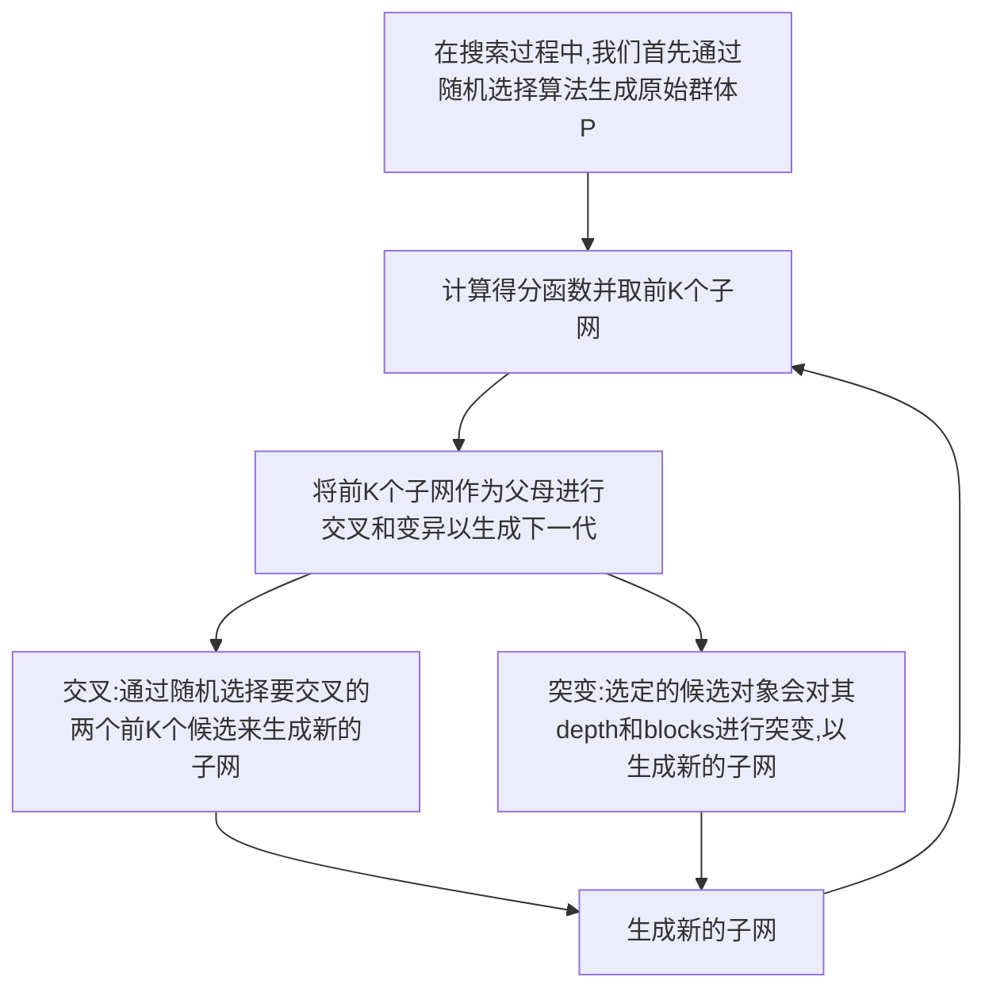

# EEG情感识别TNAS

| 论文名称 |EEG-based Emotion Recognition via Transformer Neural Architecture Search|
| -- | -- | 
| 期刊 |IEEE Transactions on Industrial Informatics 11.648/Q1|
| 方法 |本文提出了一种基于多目标进化算法(MOEA)的自动变换神经结构搜索(TNAS)框架，用于基于EEG的情感识别。所提出的TNAS执行考虑准确性和模型大小的MOEA策略，以从经过良好训练的超网中发现用于情感识别的最佳模型。|
| 结论 |所提出的TNAS在DEAP数据集上的唤醒、价和优势维度分类任务的平均准确率分别达到98.66%、98.68%和98.67%。在DREAMER数据库上，提出的TNAS在唤醒、价和优势维度分类任务上的平均准确率分别达到96.95%、96.41%和96.90%。|
| 评价 |基于Transformer的架构往往大家不会去改变标准的ViT模型，但本文使用强化学习中的NAS技术对Transformer结构进行寻优，是个非常不错强化学习与EEG分类的结合案例|

---
## 介绍
::: tip 情感识别的方法?
情感识别方法大致可分为`基于非生理信号`的方法和`基于生理信号`的方式。
- 非生理信号主要包括面部表情、言语、身体姿势和眨眼等。
- 生理信号包括心电图(ECG)、眼电图(EOG)、肌电图(EMG)和脑电图(EEG)等。

然而，非生理信号容易受到主观意识的影响，导致外部表现和内部情绪状态不一致。此外，很难通过外部行为获得一些面部或肢体有问题的残疾人的情绪状态。
:::

::: tip 为什么采用维度模型?
为了更好地描述情绪状态，在情绪识别中采用了维度模型。维度理论认为情绪是`一个高度相关的连续变量`。
:::
::: tip 如何表示维度模型
情绪状态被描述为空间中的坐标点，使用具有连续值的几个基本维度
- `唤醒arousal`
- `价值valence`
- `支配dominance`

每个维度都是情绪某个方面的度量。如图所示，提出了包括`价值valence`和`唤醒arousal`维度的双极维度模型。

`价值valence`维度范围从负到正，以表示情绪的**愉悦性**。
`唤醒arousal`维度范围从低到高，代表情绪的**兴奋程度**。
同样，维度模型通过添加`支配dominance`维度进一步解释了情绪状态，`支配dominance`维度指的是**主观控制的程度**.本文采用维度模型进行情感识别。
::: 

::: tip 为什么使用Transformer?

**长程相关性**是时间序列(如EEG)的一个**重要特征**，
- 然而，CNN通常采用**小尺寸核**来提取**更深**的特征，代价是**限制感受野**。此类操作可能会丢失部分时间序列信息，很难从长距离信号中探索全局内部特征。
- 另一方面，序列模型，如`RNN`和`LSTM`，顺序处理EEG信号，但不能**并行化**，这增加了收敛时间。

与上述方法相比，基于`Self-Attention`的`Transformer`在处理长距离时间序列信号方面显示了其优越性。
:::
::: tip NAS技术
传统的神经网络结构通常是由**人手动设计**的。以`卷积神经网络` (CNN) 为例，众所周知的神经网络结构包括 `LeNet`、`AlexNet`、`ResNet`、`GoogLeNet`、`MobileNet`，它们都是由业内专家根据经验设计的，目的在于**最大化测试准确率**、或者**最小化内存和计算开销**。

`神经网络结构搜索` (Neural Architecture Search, NAS) 的意思是**自动寻找最优**的神经网络结构，代替手动设计的神经网络。
:::

### 简述TNAS
在本文中，我们提出了一种`自动Transformer神经结构搜索`，称为`TNAS`。
- `TNAS`首先构建一个覆盖设计空间中所有候选的超级网络，并训练它在训练集上收敛，
- 然后通过`多目标进化算法`(MOEA)进行搜索，以获得基于EEG的情感识别的最佳网络结构。

### 主要成果
1. 我们**提出**了一种基于`MOEA`的端到端TNAS**框架**，以自动搜索最优Transformer架构来解决基于EEG的情感识别任务。

2. 为了全面平衡准确性和资源效率，我们**提出了MOEA**，在搜索过程中考虑`分类性能`和`模型大小`。

3. 我们对两个广泛使用的数据集进行了广泛的比较实验，例如DEAP和DREAMER数据集。实验结果表明，所提出的`TNAS`达到了**最先进的分类精度**，证明了其有效性。

## TNAS框架
提出的基于`TNAS`的情感识别是一个**端到端**系统，可以从原始EEG信号中捕获信息，用于情感分类任务。系统的流程如图所示。

- 首先对EEG数据进行`预处理`，并将其分为三个部分进行**训练**、**验证**、**测试**
- 然后在训练集上训练构造的 `超网supernet` 使其收敛。
- 应用`多目标进化算法`(MOEA)从经过良好训练的`超网supernet`中搜索最优架构，期望在**出色的性能**和**有限的资源消耗**之间取得平衡。

### Transformer
值得注意的是，NLP任务通常处理**一维数据**，而CV问题对应于**二维数据**。脑电信号是多通道时间序列信号，本文采用二维脑电数据。因此，我们采用`ViT架构`进行情感识别。

图示`ViT`的概述，其主要由三部分组成。
- 投影头projection head
- 多个堆叠编码器multiple stacked encoders
- 分类器classifier

`encoder`包含`MSA`和`MLP`(1个具有高斯误差线性单元(GELU)非线性的隐藏层)块。
此外，在每个块之前和之后分别应用`层归一化LN`和剩余连接。
::: tip 如何使二维EEG信号降维成Transformer的一维输入?
- `ViT`首先将输入$x∈ R^{H×W×C}$转换成一系列大小为$x_p∈ R^{N×(P_1·P_2·C)}$的平坦二维`patchs`，其中$(H,W)$是输入的解，$C$是通道数。$(P_1，P_2)$是`patchs`的固定大小。$N= \frac {HW}{P_1P_2}$是`patchs`数量，也表示输入序列的实际长度。

- 然后采用**可训练投影**将$x_p$映射到**d维向量**，即`patch embedding`。此外，可学习`类嵌入class embedding`$x_{class}$被放置在`patch embedding`序列的头部，**以呈现整个输入的信息**。

- `标准1D位置嵌入position embedding`$P∈ R^{(N+1)×d}$也被添加到`patch embedding`中以保留位置信息。

最终的`encoder`层的输入$z_0$的如下所示：
$$ z_{0}=\left[x_{\text {class }}, x_{p}^{1} E, x_{p}^{2} E, \ldots, x_{p}^{N} E\right]+P $$
$$ E \in \mathbb{R}^{\left(P_{1} \cdot P_{2} \cdot C\right) \times d}, P \in \mathbb{R}^{(N+1) \times d} $$
:::
`ViT`的核心机制是`多头自我注意(MSA)`，但往周我几乎都讲过`Self-Attention`层的机制，这里我就不多做介绍。

“`缩放点积注意力`”如图所示，该图计算了具有所有`Key`的`Quary`的点积，每个`Key`除以$\sqrt {d_h}$，并应用`softmax函数`以获得值的权重，如公式所示：

$$ Q=W_{Q} X $$
$$ K=W_{K} X $$
$$ V=W_{V} X $$
$$Attention  (Q, K, V)=\operatorname{Softmax}\left(\frac{Q K^{T}}{\sqrt{d_{h}}}\right) V $$
$\sqrt {d_h}$是比例因子。`多头自注意`基于`单头自注意`，采用`h投影变换`嵌入序列以获得**多组Q、K和V**。最后，`MSA``并行`执行`Self-Attention`，并投影它们的级联输出，它们可以联合关注不同位置的不同表示子空间的信息，即:

$$ \operatorname{MSA}(Q, K, V)=\operatorname{Concat}\left(\operatorname{head}_{1}, \ldots, h e a d_{h}\right) W_{o} $$

$$ head_{i}=\operatorname{Attention}\left(Q W_{i}^{Q}, K W_{i}^{K}, V W_{i}^{V}\right) $$
因此，图中所示的`MSA块`的输出$z_l^{\prime}$和`MLP块`的输出$z_l$可以公式化如下：
$$ z_{l}^{\prime}=\operatorname{MSA}\left(\mathbf{L N}\left(z_{l-1}\right)\right)+z_{l-1}, l=1, \ldots, L $$
$$ z_{l}=\operatorname{MLP}\left(\mathbf{L N}\left(z_{l}^{\prime}\right)\right)+z_{l}^{\prime}, l=1, \ldots, L $$
其中$L$表示层的数量，$LN$表示`层归一化LN`操作。

::: tip 基于MOEA的TNAS主要解决ViT结构中那些问题?

1) 如何有效地组合模型的关键**超参数**，例如`嵌入维数`、`MLP比率`(MLP中隐藏维数与嵌入维数的比率)、MSA中的`头数`和`模型深度`。

2) 如何高效搜索适合不同资源受限应用场景的各种ViT架构(端到端系统**无法支持**大型模型)。PS:ViT模型和Yolo类似,作者给出了`大型ViT`,`超大型ViT`,以及`巨无霸ViT`
:::
为了应对上述挑战，将从两个方面详细介绍所提出方法的原理：
- 权重分配机制
- MOEA策略。
### 权重分配机制

考虑到ViT的独特结构：`同质构建块`
配备`权重共享`的TNAS可以以快速且资源消耗较少的方式搜索ViT结构。
::: tip 例子
- 具有不同头数的MSA模块
- 具有不同隐藏维度的MLP
:::
我们提出了一种用于TNAS的特殊权重共享机制，其中**同质块在结构上兼容**，以实现`相互权重共享`。
- 首先构造一个包含搜索空间中所有子网的`超网Supernet`。`Supernet`将具有`最关键超参数`的`encoder块`的最大数量堆叠起来
- 搜索到的最优子网直接从训练良好的`超网Supernet`继承权重，这比`比较方法`可以获得更好的性能

权重共享的中心是**使不同块能够在同一层共享其公共部分的权重**。如图给出了构造的`超网Supernet`的概览。

`超网`由L个编码器块组成，而子网从超网的实体`部分继承权重`。
**虚线中的块**表示当前未继承的`超网权重`(子网的层可能小于L，因此子网可以灵活继承任何层的权重)。

编码器块中`MLP`和`MSA`的权重共享。我们为子网中的每一层搜索具有最佳嵌入维数、头数和MLP比率的最佳块。此外，还搜索最佳深度。

假设搜索空间$α\in S$中有一个子网有$l$层，结构及其权重可表示如下：

$$ \left\{\begin{array}{l}\alpha=\left(\alpha^{(1)}, \ldots \alpha^{(i)}, \ldots \alpha^{(l)}\right) \\ w=\left(w^{(1)}, \ldots w^{(i)}, \ldots w^{(l)}\right)\end{array}\right. $$

其中$α(i)$和$w(i)$分别表示第i层中的选定块及其权重。每个层中有多个块选择，$α(i)$和$w(i)$从搜索空间中的一组$n$个块候选中采样，如下所示：
$$ \left\{\begin{array}{l}\alpha^{(i)} \in\left\{b_{1}^{(i)}, \ldots b_{j}^{(i)}, \ldots b_{n}^{(i)}\right\} \\ w^{(i)} \in\left\{w_{1}^{(i)}, \ldots w_{j}^{(i)}, \ldots w_{n}^{(i)}\right\}\end{array}\right. $$
其中$b_{j}^{(i)}$和$w_{j}^{(i)}$是候选块及其在搜索空间中的对应权重。由于同质块结构的优点，我们只需要每层中$n$个候选块中**最大的块的权重**。

而其余较小的块可以直接利用最大块的权重。`超网Supernet`由每层中最大的块组成。因此，子网可以从经过良好训练的`超网Supernet`继承权重。

### MOEA多目标优化
为了同时在精度和模型大小之间取得平衡，我们利用Pareto理论来解决多目标优化问题。
`Pareto front`表示一组最佳解决方案，表示标准之间的权衡，并允许与决策变量建立联系。

因此，我们采用**加权和**的方法为每个**目标函数**分配不同的**权重**，如下所示：
$$score  =\max _{\alpha \in \mathcal{S}}\left(\lambda_{1}\right. val\_acc_{\alpha } \left .+\frac{\lambda_{2}}{modelsize_{\alpha } }\right) $$
其中$val\_acc_{\alpha }$表示`验证数据集`上子网$α$的精度。然后采用`MOEA`在搜索空间中搜索最优子模型，如图所示。

- 首先随机抽取一定数量的子网作为`原始群体`，并计算每个子网的得分score
- 然后，我们对迭代得分较高的优等候选进行`交叉和变异`
- 最后，我们选择**得分最高**的候选人作为**最佳模型**。
### 搜索最佳子网
为了搜索最佳子网$α^∗$, 我们创建了一个大的搜索空间，其中包含具有不同模型复杂性的多种ViT结构。此外，搜索空间中的结构覆盖了上述`关键超参数的组合`。与所有层共享相同结构的`ViT`不同，我们在每个层中使用不同的构建块结构。 

| 符号 | 含义 |
| -- | -- |
|$N(S，W)$|`搜索空间S`被编码为超网|
|$W$|是在所有候选子网$α∈S$之间共享的超网的权重|

搜索最优模型$α^∗$有两个阶段
- 优化训练参数$W$
- 搜索最优子网$α^∗$
::: tip 第一阶段
超网的权重W优化如下：
$$ W_{\mathcal{S}}=\arg \min _{W} \mathcal{L}_{\text {train }}(\mathcal{N}(\mathcal{S}, W)) $$

| 符号 | 含义 |
| -- | -- |
|$\mathcal{L}_{\text {train }}$|表示训练过程中的功能损失|
|$\mathcal{S}$|搜索空间|
|$\mathcal{N}$|超网|
|$W_{\mathcal{S}}$|初始超网权重|

我们采用**随机抽样**从超网$N(S，W)$中选择子网$α$，以**较少的资源成本**训练参数$W$。
:::

::: tip 第二阶段
通过`MOEA`训练好的的`超网`参数$W_S$，搜索最优子网$α^∗$：
$$ \alpha^{*}=\arg \max _{\alpha \in \mathcal{S}} \operatorname{score}(\mathcal{N}(\alpha, w)) $$
:::
其中子网$α$用`MOEA`抽样，`MOEA`从良好训练的$W_A$继承权重$w$。在`验证数据集上`对抽样的子网$α$的**精度**和**模型大小**计算`分数Score`。

## 训练

| 名称 | 数值/方法 |
| -- | -- |
|模型评估|10倍交叉验证|
|优化器|随机梯度下降+adam optimizer+early stopping|
|dropout|0.5|
|损失函数|交叉熵函数|
|控制器|余弦学习速率调度器|
|周期|400|
|`分数函数`中的$λ_1$|1|
|`分数函数`中的$λ_2$|1|
|原始群体P|100|
|突变数|50|
|交叉数|50|
|得分最高数K|50|
|生成迭代T数|50|
|两个数据集的块大小|128×1|

---

模型的`关键超参数`，如嵌入尺寸、MLP比率、MSA头数和模型深度范围如下：
$$ \left\{\begin{array}{c}\text { embedding dimension } \in(168,192,216,240) \\ \text { number of head } \in(2,4,6) \\ \text { MLP ratio } \in(3,3.5,4) \\ \text { depth } \in(6,7,8,9,10)\end{array}\right. $$
当我们用不同的块构建不同的层时，最终搜索空间S达到$1.4×10^{10}$。
## 结果
### 最佳模型块实例

DEAP数据集中第1个主题的唤醒维度分类任务的最佳模型块
### DEAP数据集精度

### DREAMER数据集精度

### Supernet和最优子网对比

MOEA策略搜索的最佳子网可以获得更好的性能。MOEA策略可以根据不同分类任务的特点找到最优子网。此外，我们推测超级网络性能差的原因可能是由于冗余参数导致的过度拟合。
### 详细精度比较

## 补充
### Search Space
中文又称作为搜索空间，也就是我们在选择 neural architecture 时，我们所可以调整的所有选择。举例来说，kerne size, channel size, convolution type 以及 layer number 等等。
### Search Strategy
在给定的 search space 当中，我们要透过什么方式来搜索出最好的 neural architecture。举例来说，在搜索 hyperparameter 时最为大家熟悉的 grid search 以及 random search，或是 evolution algorithm (基因演算法) 等等。