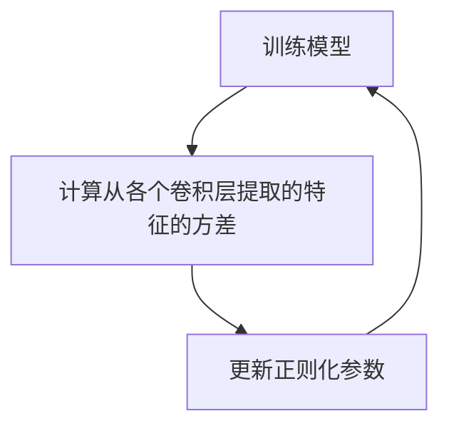

# 2.EEG情绪识别CNN+LSTM

| 论文名称 | Deep Learning Model With Adaptive Regularization for EEG-Based Emotion Recognition Using Temporal and Frequency Features|
| -- | -- | 
| 期刊 |IEEE Acess 3.476/Q2|
| 方法 |提出了一种卷积神经网络（CNN）和双向长短时记忆（Bi-LSTM）的混合多输入深度模型。CNN从原始EEG数据中提取时不变特征，Bi-LSTM允许特征之间的长距离横向交互。提出的体系结构基于深度学习和差分熵的结合。我们使用大小特征来捕获表示信号时间和频率分辨率的异构特征。此外，我们使用自适应正则化来消除模型中的偏差，并选择更有效的电极进行分类情绪。|
| 结论 | |

---
## 主要工作
- 一种多输入深度学习`CNN`+`BiLSTM`架构，用于使用两个频带的差分熵对EEG信道的原始信号进行分类
- 在第一层中，我们使用**两种尺寸**的CNN从62个信道2s的每个原始EEG的epoch中提取时间和频率特征，并与EEG频带的差分熵合并,提高模型的性能。。
- 在每个平行CNN层上应用`自适应正则化`方法来考虑EEG采集电极的空间信息，以利用不必要的通道并防止过度拟合。

## 预处理
为了去除==噪声==和==伪影==，使用0.3到50 Hz之间的**带通滤波器**对EEG数据进行预处理。
去除额外片段后收集的EEG信号长度为3300个干净的时间段。最后，每个通道中的EEG数据被划分为2s的时间段，没有重叠。将每个段都标准化为**单位方差**和**零均值**。

## CNN
::: tip 为什么第一层应用两个大小的CNN?
第一层应用两个具有小和大滤波器大小的CNN。具有不同尺寸的滤波器的想法来自于信号处理的背景，该背景提供了**时间和频率精度和分辨率之间的权衡**。
即，频率分辨率由时间序列中的样本数定义，时间分辨率始终由数据采样率定义，并且不取决于时间窗的长度。因此，小尺寸和大尺寸的滤波器最好分别提取时间和频率特征
:::
每两个1D-CNN层后跟一个最大池层以对输入表示进行下采样。1D CNN由三个主要参数组成：
- 滤波器大小
- 滤波器数量
- 步长

我们调整参数以从EEG中提取时间和频率信息。也就是说，由于我们要分析2-50 Hz范围内的信号，窗口必须至少为20毫秒长。对于两个周期，时间段的长度至少需要有8个点（EEG采样点=200，两个捕获周期的最小窗口大小=2×20ms，因此需要200×2×20ms=8个点）。
对于每个EEG信道，我们使用两个大滤波器和小滤波器CNN从$x_n$中提取$f^l_n$和$f^s_n$特征。

## 微分熵特征
熵是衡量系统无序程度的一个量。

我们使用了一种有效的频域特征和熵的概念，称为差分熵。差分熵对原始信号进行信号分解以提取有用信息。先前的研究表明，伽马和β波段$(beta：14-30 Hz，Gamma：31-50 Hz)$适用于基于EEG的情绪分类。我们计算62个信道的两个频带的差分熵，并为每个分段创建124维的特征。微分熵定义如下：
$$ \begin{aligned} h(X) &=-\int_{X} f(x) \log (f(x)) d x \\ h(X) &=1 / 2 \log \left(2 e \pi \sigma^{2}\right) \\ h_{\text {gamma }} &=1 / 2 \log \left(2 e \pi \sigma_{\text {gamma }}^{2}\right) \\ h_{\text {beta }} &=1 / 2 \log \left(2 e \pi \sigma_{\text {beta }}^{2}\right) \end{aligned} $$
其中时间序列X是高斯分布$N(µ，σ2)$。

最后，使用窗长为20s的移动平均滤波器对特征序列进行平滑

## 特征约简
该单元是一个`神经网络`，有助于提高计算速度和可靠性。在特征提取的最后，将CNN部分的输出与差分熵特征连接，然后进行特征约简网络，以选择和缩小特征空间。

## 序列学习

由于EEG信号包含时间动态信息，我们使用两层Bi-LSTM单元来提取时间信息。
Bi-LSTM可以被视为前向LSTM（Fw-LSM）和后向LSTM。假设$F_f=F$表示正向目标特征序列，$y_n$表示最终预测值，我们计算预测序列如下：$y_n=LSTM(F_{fn})$，其中LSTM表示通过使用存储块中的输入门、遗忘门和输出门处理特征序列的函数。LSTM层可计算如下：
$$ \begin{aligned} i_{t} &=\sigma\left(W_{q i} q_{t}+W_{h i} h_{t-1}+W_{c i} C_{t-1}+b_{i}\right) \\ f_{t} &=\sigma\left(W_{q f} q_{t}+W_{h f} h_{t-1}+W_{c f} C_{t-1}+b_{f}\right) \\ o_{t} &=f_{t} C_{t-1}+i_{t} \tanh \left(W_{h c} h_{t-1}+b_{c}\right) \\ o_{t} &=\sigma\left(W_{q o} q_{t}+W_{h o} h_{t-1}+W_{c o} C_{t-1}+b_{o}\right) \end{aligned} $$
LSTM函数计算如下：
$$ h_{t}=o_{t} \tanh \left(c_{t}\right)=L S T M\left(h_{t-1}, x_{t}\right) $$
其中σ是sigmoid函数，t、i、f、o和c分别是时间步长、输入门、忘记门、输出门和单元激活向量。W项是权重矩阵，b项是偏置向量。类似地，我们通过输入$F_b={f_n}^1_{n=N}$来计算反向序列。

然后，我们通过在前向和后向路径中连接$h_n$来计算隐藏向量h。序列学习单元的输出基于隐藏向量h，如下所示：

其中$W_h$和$b_h$分别是权重矩阵和偏置向量。

## 分类
最后，我们使用softmax预测每个情绪EEG段的标记。softmax层用作输出层，并给出每个类的概率计算如下：

其中$P(c|f(x_n，c))$是EEG段$x_n$标记为c类的概率，给定我们的模型计算的实际值。我们通过最小化交叉熵误差来训练模型：
$$ w=\operatorname{argmin}\left\{\frac{1}{N} \sum_{j=1}^{N} Y_{j} \log \left(Y_{j}^{\prime}\right)+\left(1+Y_{j}\right) \log \left(1-Y_{j}^{\prime}\right)\right\} $$
## 自适应正则化
自适应正则化方法的目的是找到不同的特征并减少层中的权重分布。换句话说，自适应正则化策略实际上是具有不同空间分辨率的不同电极的信息之间的折衷，在情感识别问题中保留了不必要和必要的电极。

该算法由三个交替步骤组成：

因此，自适应模型迭代地改变自适应层和前一层之间的超参数。

在本节中，我们研究一般公式中的自适应正则化方法。目标是自适应调整CNN层的正则化参数。

具体地说用${f_i}^{N_ch}_{i＝1}$表示学习单元的输出，长度R=64(2×32=CNN特征数)。为了最小化距离，我们使用标准偏差：

我们将L1惩罚和L2惩罚项应用于每个并行卷积层的核权重。正则化方法的一般形式如下：

$l()$是损失函数，$λ_i$是大和小CNN单元对的正则化参数。当f为线性形式且损失函数为平方损失时，$f_k$为线性模型系数的范数。在本文中，λ是调谐参数，其调整如下：

其中$λ_i$在[0，1]中，则$λ_0$是小于1的常数值。

## 训练
训练算法:`迭代反向传播来调整网络权重`
该算法迭代地训练模型，直到对于固定数量的训练周期性能没有改善。然后，在训练数据上估计所有可用信道的CNN表示的方差，并用于自适应调整正则化惩罚λ。在算法的第5行中，模型权重得到更新并在整个模型权重上进行 fine-tune，每次 fine-tune后，学习率降低。

| 名称 | 数值/方法 |
| -- | -- |
|模型评估|10倍交叉验证|
|优化器|随机梯度下降+adam optimizer+early stopping|
|dropout|0.5|
|损失函数|交叉熵函数|
|学习率|0.0005|
|学习衰减|0.5|
|一阶矩ADAM的衰减率|β1=0.9|
|二阶矩ADAM的衰减率|β2=0.999|
|CNN大窗口的大小|25|
|CNN小窗口的大小|10|

在特征提取结束时，将CNN部分的输出与差分熵特征连接，获得4092个特征
（62×2×32=`电极数`×`小窗口和大窗口blocks`×`1DCNNs特征数`+`124`=从62个信道提取的两个频带的差分熵），然后进行特征约简，以便通过两层神经网络进行选择。

在序列学习部分中，Bi-LSTM的单位被设置为接近特征缩减输出部分的大小，即256。

## 结果
### 分类精度

### 自适应正则化对每个电极最终贡献的影响

一组电极，如{t7、t8、TP7、FC5、FPZ、F7、F3、FC3、O1、}对激活层的输出有更大的影响。自适应正则化策略以不同的空间分辨率优化不同电极的信息使用，在情感识别问题中保留了不必要和必要的电极。从这些结果中，我们可以看出，我们的方法能够通过考虑EEG采集电极的空间信息来平滑每个平行CNN层的权重。

