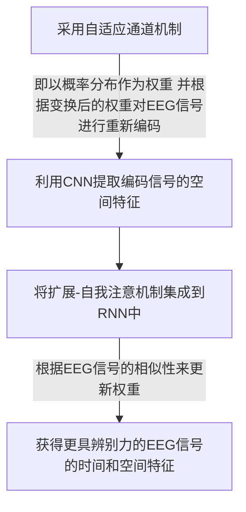
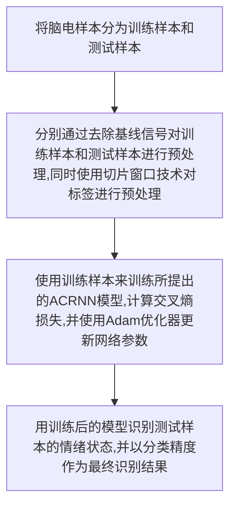

# 情绪分类Attention

| 论文名称 | EEG-based Emotion Recognition via Channel-wise Attention and Self Attention|
| -- | -- | 
| 期刊 |  IEEE Transactions on Affective Computing 13.990/Q1|
| 方法 |在本文中，我们提出了基于注意的卷积递归神经网络（ACRNN）来处理基于EEG的情感识别。原始EEG信号可以通过不同通道之间的内在关系和时间切片之间的时间依赖性包含空间信息，因此，所提出的ACRNN可以在卷积层学习多通道EEG的空间特征，并使用LSTM网络探索不同时间切片的时间特征。此外，通道式注意和扩展的自我注意机制可以分别提取更具区分性的空间和时间特征。|
| 结论 |在DEAP和DREAMER数据库上进行了实验，实验结果表明，在DEAP数据库的价分类和觉醒分类任务中，平均情绪识别准确率分别为92.74%和93.14%。此外，该方法在做梦者数据库的配价、觉醒和优势分类任务中的平均准确率分别为97.79%、97.98%和97.67% |

## ACRNN流程

### 整体思路：

### 数据预处理
在提出的ACRNN中，预处理包括==去除基线==信号和==滑动窗口==。一般来说，人类的情绪状态持续1秒到12秒，之前的研究表明，3s滑动窗口可以实现良好的分类精度，因此，我们采用了3s滑动窗.
### ACRNN结构

所提出的ACRN包括信道注意机制、CNN、RNN和扩展的自注意机制。所提出的ACRN的结构如图所示。图的左侧显示了空间特征提取模块。首先，为了探索多通道EEG信号的不同通道之间的重要性，我们以通道方式将注意力机制应用到EEG信号中。在实际的脑电信号采集中，多通道设备中的不同脑电通道通常包含冗余或相关性较小的信息。为了提高情感识别的准确性，一些方法采用频道选择来选择更多相关频道。与需要人工选择相关信道的传统方法不同，我们采用了自适应信道机制，该机制可以考虑所有信道的信息，并根据重要性为不同信道分配权重。在我们的框架中，

| 符号 | 含义 |
| -- | -- |
|$S=\{S_1，S_2，…，S_n\}$|表示预处理后的EEG样本|
|$S_i=[s_1，s_2，…，s_m]$|表示是第i个EEG样本|
|$s_j$|表示EEG样本$S_i$的第j个信道|
|m|表示是每个样本的信道总数|

在该模型中，我们首先对EEG样本的每个通道应用平均池，以获得如下通道统计信息：
$$ s^{-}=\left[s_{1}^{-}, s_{2}^{-}, \ldots, s_{m}^{-}\right] $$

| 符号 | 含义 |
| -- | -- |
|$s_{j}^{-}(j=1,2, \ldots, m)$|表示是第j个通道的平均值|

为了降低模型复杂度并提高通用性，通道式注意机制在非线性周围采用了两个完全连接（FC）层，即
- 具有参数W1和偏置项b1的维数缩减层，具有缩减比r和tanh函数作为激活函数，
- 具有参数W2和偏置项b2的维数增加层。因此，channel-wise attention表示如下：
$$ \boldsymbol{v}=\operatorname{softmax}\left(\mathbf{W}_{\mathbf{2}} \cdot\left(\tanh \left(\mathbf{W}_{\mathbf{1}} \cdot s^{-}+b_{1}\right)+b_{2}\right)\right) $$
其中，softmax函数将信道的重要性转换为概率分布$v=[v_1，v_2，…，v_m]$，其表示不同信道的重要性。最后，我们考虑概率作为权重，以记录每个通道中EEG样本的信息$S_i=[s_1，s_2，…，s_m]$。因此，通过逐通道注意提取的第j个（j=1，2，…，m）注意通道特征可以表示如下：
$$ c_{j}=v_{j} \cdot s_{j} $$

| 符号 | 含义 |
| -- | -- |
|$c$|表示提取的逐通道注意力特征|

然后，我们使用==CNN==进一步提取EEG信号的空间信息，其中卷积核的数量为k，核高度与电极的数量相同。这里，核宽度也被设计用于探索EEG信号的时间信息。此外，我们在卷积运算中使用指数线性单位（ELU）函数作为激活函数，这比常用的整流线性单位（ReLU）函数要好。因此，在卷积和激活操作之后，可以从第i个信道得到第i个特征$C_i^{'}(i=1，2，…，n)$。
之后，我们采用池层来减少参数数量并进一步提取特征。

这里，池化后的第i个编码表示是
$$ \left\{Q_{i} \mid Q_{i}=\operatorname{MaxPool}\left(C_{i}^{\prime}\right), i=1 \ldots n\right\} $$

结构图的右侧显示了时间特征提取模块，该模块包括两层LSTM和扩展的自我注意机制。

LSTM网络可以学习序列的上下文信息，因为它基于递归结构。LSTM网络已成功用于EEG情绪识别，因为它可以基于时间相关性从EEG数据中学习特征

描述LSTM单元结构的公式如下:
$$\mathbf{i}_{\mathbf{t}}=\sigma\left(\mathbf{W}_{\mathbf{i}} \cdot\left[\mathbf{h}_{\mathbf{t}-\mathbf{1}}, \mathbf{x}_{\mathbf{t}}\right]+\mathbf{b}_{\mathbf{i}}\right)$$
$$\mathbf{f}_{\mathbf{t}}=\sigma\left(\mathbf{W}_{\mathbf{f}} \cdot\left[\mathbf{h}_{\mathbf{t}-\mathbf{1}}, \mathbf{x}_{\mathbf{t}}\right]+\mathbf{b}_{\mathbf{f}}\right)$$
$$\mathbf{C}_{\mathbf{t}}=\mathbf{f}_{\mathbf{t}} * \mathbf{C}_{\mathbf{t}-\mathbf{1}}+\mathbf{i}_{\mathbf{t}} * \tanh \left(\mathbf{W}_{\mathbf{c}} \cdot\left[\mathbf{h}_{\mathbf{t}-\mathbf{1}}, \mathbf{x}_{\mathbf{t}}\right]+\mathbf{b}_{\mathbf{c}}\right)$$
$$\mathbf{o}_{\mathbf{t}}=\sigma\left(\mathbf{W}_{\mathbf{o}} \cdot\left[\mathbf{h}_{\mathbf{t}-\mathbf{1}}, \mathbf{x}_{\mathbf{t}}\right]+\mathbf{b}_{\mathbf{o}}\right)$$
$$\mathbf{h}_{\mathbf{t}}=\mathbf{o}_{\mathbf{t}} * \tanh \left(\mathbf{C}_{\mathbf{t}}\right)$$

$$ \sigma(x)=\frac{1}{1+e^{-x}}, \tanh (x)=\frac{2}{1+e^{-2 x}}-1 $$

| 名称 | 描述|
| -- | -- | 
|$h_t$|是时间步长t时的隐藏状态|
|$C_{t-1}$|是时间步长t时的细胞状态|
|$x_t$|是馈入细胞的输入特征|
|$W_f$, $W_i$, $W_c$, $W_o$|是权重|
|$b_f$, $b_i$, $b_c$, $b_o$|是通过时间反向传播可以得到的偏差|

在本研究中，每层中的LSTM单元的数量与EEG样本的数量相同，并且每个时间步中的输出可以被视为从每个样本中提取的时间信息。该网络采用==两个堆叠层==来记忆和编码所有扫描的时空区域.因此，我们将LSTM层的数量设置为两个。因此，LSTM网络的第i个输出是第二递归层的隐藏状态$\left\{h_{i}^{\prime} \mid h_{i}^{\prime}=\operatorname{lstm}\left(Q_{i}\right), i=1 \ldots n\right\}$

为了提取更具辨别力的时间信息，我们采用==扩展的自我注意机制==，通过探索每个样本的内在重要性，为每个EEG信号样本分配权重。自我注意的结构如图所示。与传统的自我注意机制不同，传统的自我注意力机制用于为每个循环编码切片分配重要性，并聚合这些信息以形成最终表示，扩展注意力是多维特征水平上加性注意的自然扩展。

通过计算来自不同点的每个样本内的相似度，它可以更好地描述特定含义，并且可以将获得的$z_i^{'}$视为来自第i个样本$h_i^{'}$的特征得分向量。此外，扩展的自我注意机制在激活函数的内部和外部添加了两个偏差项，第i个特征得分向量$z_i^{'}$可以表示如下：
$$ z_{i}^{\prime}=f\left(h_{i}^{\prime}, q_{i}\right)=W^{T} \sigma\left(W_{1} h_{i}^{\prime}+W_{2} q_{i}+b_{1}\right)+b $$

| 名称 | 描述|
| -- | -- |
|$f$|表示第i个编码EEG样本的内在相似性|
|$q_i$|是通过线性变换基于特征向量$h_i^{'}$生成的对齐模式向量，其中维数与特征向量相同|
|σ|是指数线性激活函数（ELU）|
|W|σ函数的权重项|
|b|σ函数的偏差项|
|$W_1、W_2$|是权重参数|
|$b_1$|是偏差项|

p={p1，p2，…，pn}表示所有样本的概率，第i个EEG样本的概率可以表示如下：
$$ p_{i}=\frac{\exp \left(z_{i}^{\prime T} \cdot h_{i}^{\prime}\right)}{\sum_{i=1}^{n} \exp \left(z_{i}^{\prime} \cdot h_{i}^{\prime}\right)} $$
最后，A={A1，A2，…，An}表示通过扩展自关注机制提取的特征，通过扩展自注意机制提取的第i个关注特征可以计算如下：
$$ A_{i}=p_{i} \cdot h_{i}^{\prime} $$
在所提出的ACRN的最后一部分中，我们使用softmax层作为分类器。提取的时空注意力特征是A={A1，A2，…，An}，softmax分类器接收这些提取的特征作为输入，以识别情感，如下所示：
$$ \boldsymbol{P}=\operatorname{softmax}(W \boldsymbol{A}+b) $$

| 名称 | 描述|
| -- | -- |
|$\boldsymbol{P}=\left\{P_{1}, P_{2}, \ldots, P_{n}\right\}, P_{i}(i=1,2, \ldots, n)$|表示第i个EEG样本的预测概率|
|W|softmax函数的权重项|
|b|softmax函数的偏差项|

然后，评估所有标记样本的交叉熵误差：
$$ \mathcal{L}=-\sum_{i=1}^{n} \hat{Y}_{i} \log \left(P_{i}\right) $$

| 名称 | 描述|
| -- | -- |
|$\hat{Y}_{i}$|是第i个EEG样本的标签，较低的交叉熵误差L表示较高的情感识别精度|

总之，我们设计了一个从原始脑电信号中提取特征和分类情感的框架。
- 采用了一种基于通道的注意机制，自适应地分配不同通道的权重，可以提取通道之间的内在信息.
- 利用CNN提取编码EEG信号的空间信息。
- 采用两层LSTM来探索不同EEG样本的时间信息，并集成扩展的自我注意机制，根据每个样本的重要性为EEG样本分配权重。
- 获得用于EEG情感识别的时空注意力特征。

## 训练

| 名称 | 数值/方法 |
| -- | -- |
|模型评估|10倍交叉验证|
|优化器|adam optimizer+early stopping|
|归一化|Batch normalization|
|dropout|0.5|
|损失函数|交叉熵函数|
|学习率|0.0001|
|LSTM中隐藏状态的维度|64|
|核的数量k|40|
|池的大小|1×75|
|步长|10|

## 结果
### 对比模型
设计了三个模型来演示通道式注意和扩展自我注意机制的影响，包括CNN+RNN（CNN-RNN）、通道式注意机制+CNN+NN（A-CNN-RNN）和CNN+RTN+扩展自我注意机制（CNN-RNN-A）

###  channel weight on DEAP database

FC5、P3、C4和P8的信道权重在DEAP数据库中的二维上明显大于其他信道。

### 对比结果

::: tip Attention的重要性
与基线框架CNN-RNN相比，A-CNN-NN的平均识别精度在二维上分别提高了约30%和25%。
:::
::: tip 扩展Attention的重要性
与A-CNN-RNN相比，所提出的ACRNN将平均识别精度分别提高了0.6%和0.5%.
因为ACRNN结合了信道和扩展的自我注意机制来提取EEG信号的时空注意信息
:::

::: tip 信道和扩展的Attention的重要性
与CNN-RNN-A相比，所提出的ACRN在二维上提高了大约3%的识别精度，因为所提出的模型同时利用了两种注意机制。
:::
## 补充

### 预处理
为了避免EEG信号中的伪影，例如眨眼，应使用伪影去除方法对EEG信号进行预处理，例如盲源分离和独立分量分析。

### 特征提取
为了从EEG信号中提取相关的情感特征，研究了EEG信号的信息，例如时间、频率和空间域的EEG特征。

各种分类器可用于对提取的特征进行分类，例如贝叶斯、支持向量机、决策树和深度学习分类器。根据分类器是否根据用户相关数据进行训练，EEG情感识别也可分为用户相关任务和用户无关任务。

## Channel-wise Attention（通道注意力机制） ：
受人类注意机制的启发，空间注意机制（spatial attention mechanisms ）被提出用于各种视觉任务，例如语义注意（semantic attention）、多层注意（multi-layer attention）和通道注意（ channel-wise attention）。通道注意力机制表现出优越的性能，因为它可以改变不同通道的权重来探索特征图的信息；因此，它可以提取有关通道的更重要的信息。因此，基于通道的注意机制被用来利用特征通道之间的相互依赖性。

一般来说，通道注意力机制可以==压缩全局空间信息==并==生成通道性统计信息==。此外，它可以通过CNN进行培训，因此，它可以==集成到CNN架构==中。考虑到多通道脑电信号通过通道包含空间信息，可将通道注意集成到CNN中，以探索脑电信号通道之间的重要性，并通过CNN提取更具辨别力的空间信息。

## Self Attention（自我注意力机制）：
--sa--是一种内部注意机制，它将单个序列的不同位置关联起来，以基于重要性得分对序列数据进行编码。此外，--sa--很受欢迎，因为它可以改进长期依赖性建模。注意函数可以描述为将查询和一组键值对映射到输出，其中查询、键、值和输出都是向量。输出作为值的加权和计算，其中分配给每个值的权重由查询与相应键的兼容函数计算。自我注意力在简单的语言问答和语言建模任务中表现良好。在EEG识别任务中，为了增加训练样本的数量，一个EEG试验通常被分割成几个输入样本。然而，许多方法忽略了不同脑电样本的重要性。受自我注意力机制的启发，我们采用这种技术来进一步探索脑电样本之间的时间依赖性。