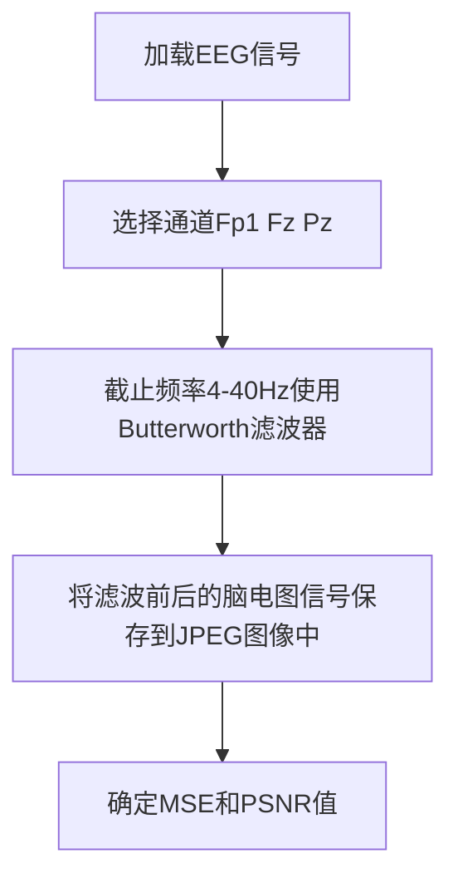
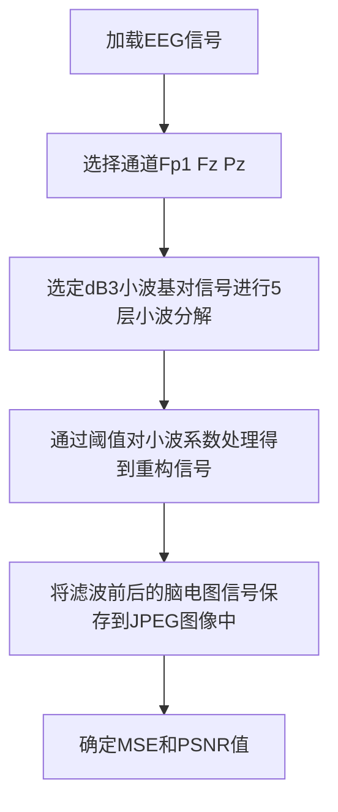

# 对于EEG信号SWT与Butterworth滤波器比较
## EEG信号分类

| 名称 | 频段 | 说明 |
| -- | -- | -- |
| `delta` | (0.4-4Hz) | |
| `theta` | (4-8Hz) |θ波代表冥想、活动改善、记忆增强和压力降低|
| `alpha` | (8-13Hz) |α节律代表稳定状态|
| `beta` | (13-30Hz) |β节律代表沉浸程度|
| `gamma` | (30Hz以上) |gamma波代表紧张和活跃的高度认知过程|
## 伪影干扰
如==电力线干扰==、==肌肉运动(肌电图伪影)==、==眨眼(眼电图伪影)==。
原始脑电信号由于振幅较小，通常会受到各种伪影的污染。
## 滤波器介绍
### 目的
为了保持原始信号，滤波器应该有特定的要求。滤波过程的目的是保留信号的特定频率。从干净的脑电图信号中获得的信息可用于临床;如检测癫痫、昏迷、颅脑损伤、脑损伤及脑卒中。
### 评价指标
#### 均方误差(MSE)

其中x、y为两个有限长度(离散信号)，N为信号样本的个数，xi、yi为x、y中第i个样本的值。
#### 峰值噪声比(PSNR)
MSE值通常转换为PSNR值，以分贝值来确定图像的质量。

其中L为允许图像像素强度的动态范围。

## 4阶巴特沃斯带通滤波器
### 频率(带通)选择
截止频率为==4 ~ 40 Hz==
delta频率(低于4hz)被消除了，因为它被认为是噪声，而40hz在分析过程所需的伽马频率范围内，也可以消除电源线干扰(50至60hz)。

### 流程

#### 流程图注解
选择这些通道是因为它对分析记忆过程很重要。通道分别为Fp1(注意)、Fz(工作记忆)和Pz(认知加工)。


## 平稳小波变换滤波器
### 频率(带通)选择
选择了具有5个分解层次的dB3小波母波
选择该小波母是因为它能够检测和定位脑电信号中的峰值。突波特征包括==肌电信号(肌肉运动)==、==眼电信号(眨眼)==。SWT筛选包括三个步骤。
1. `剔除高频噪声`
2. `采用软阈值法剔除低频噪声`
3. `重构信号`

### 流程

### MSE误差
| 滤波器名称 | Fp1 | Fz | Pz |
| -- | -- | -- | -- |
| `Butterworth` | 20.42 | 24.50 | 30.50 |
| `SWT` | 2.43 | 2.32 | 2.01 |
```js
// --echarts--
function (chart) {
chart.setOption({
    // backgroundColor: '#2c343c',

    title: {
        text: '滤波器MSE分析',
        left: 'center',
        top: 0,
        textStyle: {
            color: '#888'
        }
    },
    legend: {top: 30,},
    tooltip : {
        trigger: 'axis',
        axisPointer: {
        type: 'shadow'
        }
    },
    toolbox: {
        show: true,
        orient: 'vertical',
        left: 'right',
        top: 'center',
        feature: {
        mark: { show: true },
        dataView: { show: true, readOnly: false },
        magicType: { show: true, type: ['line', 'bar', 'stack'] },
        restore: { show: true },
        saveAsImage: { show: true }
        }
  },
    dataset: {
          // 提供一份数据。
          source: [
              ['MSE', 'Butterworth', 'SWT'],
              ['Fp1', 20.42, 2.43],
              ['Fz', 24.5, 2.32],
              ['Pz', 30.5, 2.01],
          ]
      },
    xAxis: {type: 'category'},
    yAxis: {type: 'value'},
    series: [
        {
            type: 'bar',
            emphasis: {
                focus: 'series'
            },
            itemStyle: {
              normal: {
                label: {
                  show: true, //开启显示
                  position: 'top', //在上方显示
                  textStyle: {
                    //数值样式
                    color: 'black',
                    fontSize: 12,
                  },
                },
              },
            }, 
          },
        {
            type: 'bar',
            emphasis: {
                focus: 'series'
            },
            itemStyle: {
              normal: {
                label: {
                  show: true, //开启显示
                  position: 'top', //在上方显示
                  textStyle: {
                    //数值样式
                    color: 'black',
                    fontSize: 12,
                  },
                },
              },
            }, 
          },
         
      ]
}, true)
}
```

### PSNR误差
| 滤波器名称 | Fp1 | Fz | Pz |
| -- | -- | -- | -- |
| `Butterworth` | 35.07 | 34.27 | 33.32 |
| `SWT` | 44.30 | 44.52 | 54.12 |
```js
// --echarts--
function (chart) {
chart.setOption({
    // backgroundColor: '#2c343c',

    title: {
        text: '滤波器PSNR分析',
        left: 'center',
        top: 0,
        textStyle: {
            color: '#888'
        }
    },
    legend: {top: 25,},
    tooltip : {
        trigger: 'axis',
        axisPointer: {
        type: 'shadow'
        }
    },
    toolbox: {
        show: true,
        orient: 'vertical',
        left: 'right',
        top: 'center',
        feature: {
        mark: { show: true },
        dataView: { show: true, readOnly: false },
        magicType: { show: true, type: ['line', 'bar', 'stack'] },
        restore: { show: true },
        saveAsImage: { show: true }
        }
  },
    dataset: {
          // 提供一份数据。
          source: [
              ['MSE', 'Butterworth', 'SWT'],
              ['Fp1', 35.07, 44.3],
              ['Fz', 34.27, 44.52],
              ['Pz', 33.32, 45.12],
          ]
      },
    xAxis: {type: 'category'},
    yAxis: {type: 'value'},
    series: [
        {
            type: 'bar',
            emphasis: {
                focus: 'series'
            },
            itemStyle: {
              normal: {
                label: {
                  show: true, //开启显示
                  position: 'top', //在上方显示
                  textStyle: {
                    //数值样式
                    color: 'black',
                    fontSize: 12,
                  },
                },
              },
            }, 
          },
        {
            type: 'bar',
            emphasis: {
                focus: 'series'
            },
            itemStyle: {
              normal: {
                label: {
                  show: true, //开启显示
                  position: 'top', //在上方显示
                  textStyle: {
                    //数值样式
                    color: 'black',
                    fontSize: 12,
                  },
                },
              },
            }, 
          },
         
      ]
}, true)
}
```
## 结论
平稳小波变换在三个通道处的==PSNR==值要比Butterworth带通滤波器大。
这意味着更多的噪音被过滤掉了。SWT滤波器能够去除肌电图和眼电图的伪影，而Butterworth带通滤波器不能去除所有伪影。与巴特沃斯带通滤波器相比，平稳小波变换去除噪声效果更好。

## 补充
### WT滤波器原理
#### 短时傅立叶变换（Short-time Fourier Transform,STFT）

也叫加窗傅立叶变换，顾名思义，就是因为傅立叶变换的时域太长了，所以要弄短一点，这样就有了局部性。

定义：把整个时域过程分解成无数个==等长==的小过程，每个小过程近似平稳，再傅里叶变换，就知道在哪个时间点上出现了什么频率了。”这就是短时傅里叶变换。时域上分成一段一段做FFT，就知道频率成分随着时间的变化情况了.

#### 基函数
- FT的基函数，不具有紧支撑性，只能筛选频率，使得FT完全丧失了时间信息，不具有时间分辨率。

- STFT的基函数，是用窗函数截断的sin,cos，具有了紧支撑性，时域平移等同于分窗，使得STFT既能筛选频率，也能筛选时间。但是STFT基函数是：先确定频率，再与窗函数相乘构成的。因此不同的频率，具有同样的时间和频率分辨率。另外，窗函数的长短也比较难以确定。

- CWT的基函数，是小波函数，具有紧支撑性，时域平移等同于分窗，使得CWT既能筛选频率，也能筛选时间。小波函数在改变频率的时候，是通过“缩放”实现的，这使得小波函数在改变频率的同时，改变了窗长。因此不同的频率，具有不同的时间和频率分辨率，实现了分辨率动态可调。

#### 窗口时间
1. 对于低频信号，为了更好地确定频率，我们希望，时域区间宽一些，即时间不确定度大一些，根据海森堡测不准原理，频率不确定度自然小一些；即低频信号，我们希望：宽窗子，低的时域分辨率，高的频域分辨率。

2. 对于高频信号，为了更好地在时域定位，我们希望，时域区间窄一些，即时间不确定度小一些，根据海森堡测不准原理，频率不确定度自然大一些；即高频信号，我们希望：窄窗子，高的时域分辨率，低的频域分辨率。

可能理解这一点最好的方式是举例子。首先，因为我们的变换是对时间和频率的函数（不像傅立叶变换，仅仅是对频率的函数），它是二维的（如果加上幅度则是三维）。


#### 小波
所以窄窗口时间分辨率高、频率分辨率低，宽窗口时间分辨率低、频率分辨率高。
对于加窗傅立叶变换让人头疼的就是窗口的大小问题，如果我们让窗口的大小可以改变，不就完美了吗？答案是肯定的，小波就是基于这个思路，但是不同的是。STFT是给信号加窗，分段做FFT；而小波变换并没有采用窗的思想，更没有做傅里叶变换。小波直接把傅里叶变换的基给换了——将无限长的三角函数基换成了==有限长的会衰减的小波基==。这样不仅能够获取频率，还可以定位到时间了


从公式可以看出，不同于傅里叶变换，变量只有频率ω，小波变换有两个变量：尺度a（scale）、平移量 τ（translation）。
#### 小波参数
==尺度a==控制小波函数的伸缩
1. a小,相当于挤压,频率提高
2. a大相当于拉伸,频率降低

==平移量τ==控制小波函数的平移。

公式前的系数是为了能量守恒,没有特别目的。
尺度就对应于频率（反比），平移量τ就对应于时间。


#### 小波过程
小波变换用于去噪的过程分为三个阶段：
1. 分解过程：选定一种小波基，对信号进行N层小波分解。
2. 选择阈值过程：对分解得到的各层系数选择一个阈值，并对细节系数用软阈值处理。
3. 重建过程：将处理后的系数通过小波重建恢复原始信号。

#### 阈值函数


首先小波变换其实生成的是连续值，一维连续信号小波变换生成二维连续值。
而正交小波则可以生成离散值（虽然也可以是连续值，但是由于逆变换只需要一系列离散的值，因此只分析离散的点即可。也就是我们通常用的小波分析）。

连续小波变换（这里特指正交小波的连续小波变换）是通过改变分析窗口的尺度，及时移动窗口，与信号做内积（对时间进行积分）来计算的。

在离散情况下，可以理解为采用不同截止频率的滤波器对信号进行不同尺度的分析。信号通过一系列高通滤波器来分析高频，信号通过一系列低通滤波器来分析低频。


无滤波器


8-30hz带通滤波器


小波滤波 db3 level=3 硬阈值

小波滤波 db3 level=5 软阈值2


带通滤波器 + 小波滤波 db3 level=3 软阈值1

小波滤波 db3 level=3 软阈值1

### 总结评价
小波可能只存在于paper中，而不在工程中吧。
```

import mne
import numpy as np
import scipy.io as sio
import matplotlib.pyplot as plt
from mne.decoding import CSP
from sklearn.svm import SVC
from sklearn.pipeline import Pipeline
from sklearn.model_selection import ShuffleSplit, KFold
from sklearn.model_selection import cross_val_score
import pywt
import math


load_path = "P:/Item/EEG/bci2003/dataset_BCIcomp1.mat"
load_data = sio.loadmat(load_path)
eeg_data = np.array(load_data["x_train"]).T
label = np.array(load_data["y_train"])
bandFreqs = [
    {'name': 'Delta', 'fmin': 1, 'fmax': 3},
    {'name': 'Theta', 'fmin': 4, 'fmax': 7},
    {'name': 'Alpha', 'fmin': 8, 'fmax': 13},
    {'name': 'Beta', 'fmin': 14, 'fmax': 31},
    {'name': 'Gamma', 'fmin': 31, 'fmax': 40}
]
#sgn函数
def sgn(num):
    if(num > 0.0):
        return 1.0
    elif(num == 0.0):
        return 0.0
    else:
        return -1.0

def wavelet_noising(new_df):
    data = new_df
    data = data.T.tolist()  # 将np.ndarray()转为列表
    w = pywt.Wavelet('dB3')#选择dB3小波基
    maxlev = pywt.dwt_max_level(len(data), w.dec_len)
    ca3, cd3, cd2, cd1 = pywt.wavedec(data, w, level=3)  # 3层小波分解

    length1 = len(cd1)
    length0 = len(data)

    abs_cd1 = np.abs(np.array(cd1))
    median_cd1 = np.median(abs_cd1)

    sigma = (1.0 / 0.6745) * median_cd1
    lamda = sigma * math.sqrt(2.0 * math.log(float(length0 ), math.e))
    usecoeffs = []
    usecoeffs.append(ca3)
    #软阈值方法
    for k in range(length1):
        if (abs(cd1[k]) >= lamda/np.log2(2)):
            cd1[k] = sgn(cd1[k]) * (abs(cd1[k]) - lamda/np.log2(2))
        else:
            cd1[k] = 0.0

    length2 = len(cd2)
    for k in range(length2):
        if (abs(cd2[k]) >= lamda/np.log2(3)):
            cd2[k] = sgn(cd2[k]) * (abs(cd2[k]) - lamda/np.log2(3))
        else:
            cd2[k] = 0.0

    length3 = len(cd3)
    for k in range(length3):
        if (abs(cd3[k]) >= lamda/np.log2(4)):
            cd3[k] = sgn(cd3[k]) * (abs(cd3[k]) - lamda/np.log2(4))
        else:
            cd3[k] = 0.0

    usecoeffs.append(cd3)
    usecoeffs.append(cd2)
    usecoeffs.append(cd1)
    recoeffs = pywt.waverec(usecoeffs, w)#信号重构
    return recoeffs

def __CalcWP(data, sfreq, wavelet, maxlevel, band):
    # 如果maxlevel太小部分波段分析不到
    wp = pywt.WaveletPacket(data=data, wavelet=wavelet, mode='symmetric', maxlevel=maxlevel)
    # 频谱由低到高的对应关系，这里需要注意小波变换的频带排列默认并不是顺序排列，所以这里需要使用’freq‘排序。
    freqTree = [node.path for node in wp.get_level(maxlevel, 'freq')]
    # 计算maxlevel最小频段的带宽，采样频率的一半
    freqBand = (sfreq/2) / (2 ** maxlevel)
    bandResult = []
    #######################根据实际情况计算频谱对应关系，这里要注意系数的顺序
    for iter_freq in band:
        # 构造空的小波包
        new_wp = pywt.WaveletPacket(data=None, wavelet=wavelet, mode='symmetric', maxlevel=maxlevel)
        for i in range(len(freqTree)):
            # 第i个频段的最小频率
            bandMin = i * freqBand
            # 第i个频段的最大频率
            bandMax = bandMin + freqBand
            # 判断第i个频段是否在要分析的范围内
            if (iter_freq['fmin'] <= bandMin and iter_freq['fmax'] >= bandMax):
                # 给新构造的小波包参数赋值
                # print('freq',bandMin, bandMax,'fmin',iter_freq['fmin'],'fmax',iter_freq['fmax'])
                new_wp[freqTree[i]] = wp[freqTree[i]].data
        # 计算对应频率的数据
        bandResult.append(new_wp.reconstruct(update=True))
    return bandResult

########################################小波包变换-重构造分析不同频段的特征(注意maxlevel，如果太小可能会导致部分频段分析不到)#########################
# 定义WP函数
# epochsData:epochs的数据（mumpy格式）
# sfreq:采样频率
# wavelet:小波类型
# maxlevel:小波层数
# band:频带类型

def WP(epochsData, sfreq, wavelet='db3', maxlevel=8, band=bandFreqs):
    # 输出的维度顺序为 频率->epoch->channel->timeData
    result = []
    for epochData in epochsData:
        channel = []
        for channelData in epochData:
            # print('channel:')
            channel.append(__CalcWP(channelData, sfreq, wavelet=wavelet, maxlevel=maxlevel, band=band))
        result.append(channel)
    return np.array(result).transpose((2, 0, 1, 3))
'''
构建一个Raw对象时,需要准备两种数据,一种是data数据,一种是Info数据,
data数据是一个二维数据,形状为(n_channels,n_times)
'''
ch_names = ['C3','Cz','C4']  # 通道名称
ch_types = ['eeg', 'eeg', 'eeg']  # 通道类型
sfreq = 128  # 采样率
info = mne.create_info(ch_names, sfreq, ch_types)  # 创建信号的信息
info.set_montage('standard_1020')

raw_0 = eeg_data[0, :, :]
for i in range(1, 140):
    raw_i = eeg_data[i, :, :]
    raw_0 = np.concatenate((raw_0, raw_i), axis=1)
raw_data = raw_0
#raw_data = wavelet_noising(raw_data)
raw_data[0] = wavelet_noising(raw_data[0])
raw_data[1] = wavelet_noising(raw_data[1])
raw_data[2] = wavelet_noising(raw_data[2])
# print(raw_data.shape)
# >>>(3, 161280)
raw = mne.io.RawArray(raw_data, info)
# print(raw)
# raw.plot(scalings={'eeg': 'auto'})
# print('数据集的形状为：',raw.get_data().shape)
# print('通道数为：',raw.info.get('nchan'))

# FIR带通滤波
#raw.filter(8., 30., fir_design='firwin', skip_by_annotation='edge')
'''
在创建Epochs对象时,必须提供一个"events"数组,
事件(event)描述的是某一种波形(症状)的起始点,其为一个三元组,形状为(n_events,3):
第一列元素以整数来描述的事件起始采样点;
第二列元素对应的是当前事件来源的刺激通道(stimulus channel)的先前值(previous value),该值大多数情况是0;
第三列元素表示的是该event的id.
'''
# 创建 events & event_id
events = np.zeros((140, 3), dtype='int')
k = sfreq * 3
for i in range(140):
    events[i, 0] = k
    k += sfreq * 9
    events[i, 2] = label[i]
# print(events)
event_id = dict(left_hand=1, right_hand=2)

# 创建epochs
tmin, tmax = -1., 4.  # 记录点的前1秒后4秒用于生成epoch数据
epochs = mne.Epochs(raw, events, event_id
                    , tmin, tmax
                    , proj=True
                    , baseline=(None, 0)
                    , preload=True)
# 想要分析的目标频带
#bandIndex = 4
firFilter = epochs.copy().filter(bandFreqs[1]['fmin'], bandFreqs[4]['fmin'])
# 计算小波包滤波后的数据并绘图
wpFilter = WP(epochs.get_data(), sfreq)
epochs.selection = wpFilter
#获取小波分解的最大层级
maxlev = pywt.swt_max_level(len(epochs.get_data()))
coeffs= pywt.swt(epochs.selection,'db3', level = maxlev) # 将信号进行小波分解
coeffs[0][0].fill(0)
coeffs[maxlev-1][1].fill(0)
datarec = pywt.iswt(coeffs,'db3') # 将信号进行小波重构


###使用滤波器
#epochs = firFilter
#epochs.selection = datarec


epochs_train = epochs.copy().crop(tmin=1., tmax=2.)  # 截取其中的1秒到2秒之间的数据，也就是提示音后
# 1秒到2秒之间的数据（这个在后面滑动窗口验证的时候有用）

labels = epochs.events[:, -1]
# print(labels)
#特征提取和分类
scores = []
epochs_data = epochs.get_data()                       #获取epochs的所有数据，主要用于后面的滑动窗口验证
#print(epochs_data.shape)
#>>>(140, 3, 641)
epochs_data_train = epochs_train.get_data()           #获取训练数据
#print(epochs_data_train.shape)
#>>>(140, 3, 129)                                     #也是多了一个
kf = KFold(n_splits=5                                 #交叉验证模型的参数
           , shuffle=True
           , random_state=42)
cv_split = kf.split(epochs_data_train)                #输出索引以将数据分为训练集和测试集
svm = SVC()                                           #支持向量机分类器
csp = CSP(n_components=2                              #2个分量的CSP
          ,reg=None
          ,log=False
          ,norm_trace=False)
clf = Pipeline([('CSP', csp), ('SVM', svm)])          #创建机器学习的Pipeline
scores = cross_val_score(clf                          #获取交叉验证模型的得分
                         , epochs_data_train
                         , labels
                         , cv=kf
                         , n_jobs=-1)
class_balance = np.mean(labels == labels[0])          #输出结果，准确率和不同样本的占比
class_balance = max(class_balance, 1. - class_balance)
print("Classification accuracy: %f / Chance level: %f" % (np.mean(scores)
                                                          , class_balance))
csp.fit_transform(epochs_data, labels)
csp.plot_patterns(epochs.info                         #绘制CSP不同分量的模式图
                  , ch_type='eeg'
                  , units='Patterns (AU)'
                  , size=1.5)
# 验证算法的性能
w_length = int(sfreq * 1.5)  # 设置滑动窗口的长度
w_step = int(sfreq * 0.1)  # 设置滑动步长
w_start = np.arange(0, epochs_data.shape[2] - w_length, w_step)
# 每次滑动窗口的起始点
scores_windows = []  # 得分列表用于保存模型得分
# 交叉验证计算模型的性能
for train_idx, test_idx in cv_split:
    y_train, y_test = labels[train_idx], labels[test_idx]  # 获取测试集和训练集数据
    X_train = csp.fit_transform(epochs_data_train[train_idx], y_train)  # 设置csp模型的参数，提取相关特征，用于后面的svm分类
    svm.fit(X_train, y_train)  # 拟合svm模型
    score_this_window = []  # 用于记录本次交叉验证的得分
    for n in w_start:
        X_test = csp.transform(epochs_data[test_idx][:, :, n:(n + w_length)])  # csp提取测试数据相关特征
        score_this_window.append(svm.score(X_test, y_test))  # 获取测试数据得分
    scores_windows.append(score_this_window)  # 添加到总得分列表
w_times = (w_start + w_length / 2.) / sfreq + epochs.tmin  # 设置绘图的时间轴，时间轴上的标志点为窗口的中间位置

# 绘制模型分类结果的性能图
plt.figure()
plt.plot(w_times, np.mean(scores_windows, 0), label='Score')
plt.axvline(0, linestyle='--', color='k', label='Onset')
plt.axhline(0.5, linestyle='-', color='k', label='Chance')
plt.xlabel('time (s)')
plt.ylabel('classification accuracy')
plt.title('Classification score over time')
plt.legend(loc='lower right')
plt.show()
```