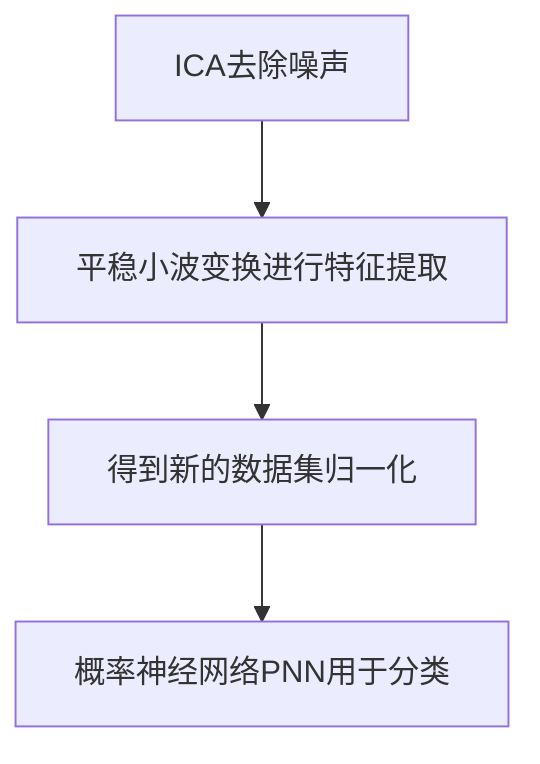

# 基于ICA、SWT和PNN的酒精中毒分类

## 步骤
1. 软件设计首先对数据进行预处理，利用==独立分量分析ICA==去除100个脑电图数据的噪声。
2. 利用==平稳小波变换==对信号进行分解。在这一步中，信号将被分为两个部分，分别是细节部分和近似部分。本文在测试用例中使用了母小波db族3-6级分解。
3. 获得特征。分解后得到四个特征，分别是最大值、最小值、平均值和偏差值。从这一步获得的值是一个新的训练和测试数据集。
4. 对数据集进行归一化，并使用==概率神经网络==(probability Neural Network, PNN)对数据集进行分类。

## SWT介绍
**平稳小波变换**(SWT)是一种利用高通滤波器和低通滤波器将信号分解为低频信号或称为近似信号和高频信号或称为细节信号的分解方法。小波变换与离散小波变换的不同之处在于小波变换中的下采样。而在SWT中，所有级别的系数量保持不变。

## PNN介绍
PNN采用一种神经网络监督训练方法(https://zhuanlan.zhihu.com/p/37522266)。PNN包括一种前馈结构，前馈结构有四层，分别是==输入层==、==隐层==、==求和层==和==输出层==。

输入层由特征向量组成。隐层使用概率密度函数计算特征向量。概率密度函数公式如式3所示。

PNN的第三层是求和层，在这一层中，同一类的每个节点都将使用公式4进行相加。

输出层将根据汇总层的结果比较生成一个类。得分更好的将被选为类。

混淆矩阵包含测试用例中的一个真值和一个假值。本文给出了混淆矩阵的准确度、灵敏度和特异性三种计算公式。

## 实验结果

## 总结
经过测试和评估，第一个场景的准确率最高，为82.50%，属于6级分解。对于第二种情况，每一种daubechies在准确性、敏感性和特异性上没有差异。最后一种场景的准确率最高，通过对6级、db4类型的daubechies和0.6的PNN偏差值进行最优参数分解，准确率为85.00%，灵敏度为100%，特异性为70.00%。结果将所有酗酒者归为酗酒者，将6名正常者归为错误分类。该模型由独立分量分析(ICA)、平稳小波变换(SWT)和概率神经网络(PNN)组成，是一种有效的酒精主题分类方法

## 补充
### 盲源分离
对于一组3个模拟信号，如正弦、余弦、随机信号

经过随机混合，由6个麦克风录制下来，则观测信号为

我们希望将他们分解开，这时就该ICA出场了。但在ICA之前，往往会对数据有一个预处理过程，那就是PCA与白化。白化在这里先不提，PCA本质上来说就是一个降维过程，大大降低ICA的计算量。PCA，白化后的结果如下图所示。可以看到，原先的6路信号减少为3路，ICA仅需要这3路混合信号即可还原源信号。

下面，ICA经过多步迭代寻优，就会按照信号之间独立最大的假设，将信号解混输出。

总的来说，ICA认为观测信号是若干个统计独立的分量的线性组合，ICA要做的是一个解混过程。
而PCA是一个信息提取的过程，将原始数据降维，现已成为ICA将数据标准化的预处理步骤。
:::: group 参考文献
::: group-item *文章 1
[1] A.Hyva ̈rinen, J. Karhunen, and E. Oja, Independent Component Analysis,Wiley-Interscience, New York, 2001
:::

::: group-item 文章 2
test 2
[2] J.-F.Cardoso, “Blind signal separation: statistical principles”,Pro- ceedings of the IEEE, vol. 90, n. 8, pp. 2009-2026, October 1998.
:::

::: group-item 文章 3
[3] A. Hyva ̈rinen and E. Oja, ”A Fast Fixed-Point Algorithm for Inde- pendent Component Analysis”. Neural Computation, 9(7):1483-1492, 1997.
:::

::: group-item 文章 4
[4] A. Hyva ̈rinen, “Fast and Robust Fixed-Point Algorithms for Inde- pendent Component Analysis”. IEEE Trans. on Neural Networks,10(3):626-634, 1999.
:::
::::