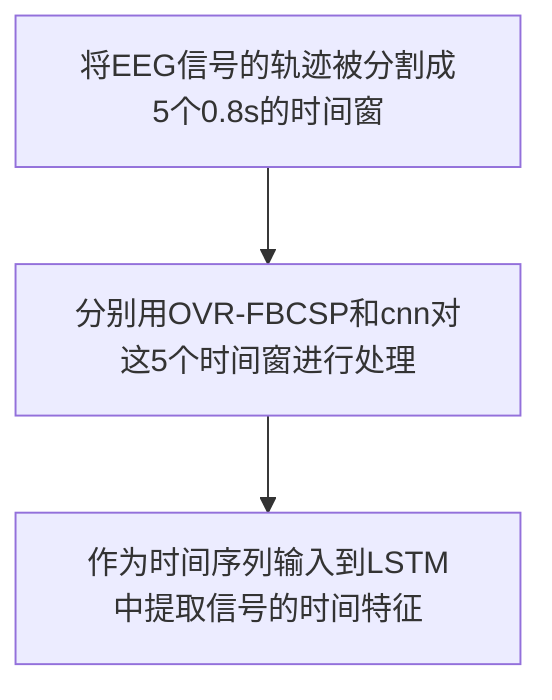

# CNN-LSTM
## 简介
提出了一种端到端基于CNN-LSTM的四类MI深度学习算法，用于从脑电数据中解码MI任务。该算法由两部分组成:a.采用单对单滤波器组公共空间模式(OVR-FBCSP)对四类MI信号进行预处理和特征预提取。b.提出了一种基于CNN和LSTM网络的混合深度网络，可以同时提取和学习MI信号的时空特征。本文的主要贡献是提出了一种混合深度网络框架来提高四类MI-EEG信号的分类精度。混合深度网络是一个与主体无关的共享神经网络，这意味着它可以利用所有主体的训练数据形成一个模型进行训练。该算法在BCI竞争IV数据集2a上的分类精度为83%，Cohen’s kappa值为0.80。

## 创新
- 提出了一种新的混合深度学习框架，结合CNN和LSTM来学习MI信号的空间特征和时间特征。
- 在分类前引入一对一滤波器组共同空间模式(OVR-FBCSP)，利用一个FBCSP滤波器提取脑电信号的四类MI特征;
- 所提出的混合神经网络也是一个独立于学科的共享神经网络，它由所有学科的合并数据进行训练，并由每个subject分别评价。

## 数据集
数据集是由Graz University提供的BCI Competition IV dataset 2a，包括从22个电极在左手/右手，脚，舌头MI任务的记录。

## 结构

它包括三个连续的阶段:==OVR-FBCSP==、==CNNs==和==LSTM==。

### 分解信号
采用时间窗对各MI任务的脑电试验进行预处理。将BCI Competition IV数据集2a的每4条脑电轨迹分解为5个时间窗。为250Hz信号，每个时间窗口对应200个样本。

### OVR-FBCSP
利用切比雪夫II型滤波器组将每个时间窗口的脑电信号分解为16个通频带，其中包含16个滤波器，从4Hz到38Hz，每个滤波器的带宽为4Hz，重叠2Hz。采用OVR-FBCSP算法进行空间滤波。OVR-FBCSP方法可以提取CSP特征来区分多类MI任务分类中的一个类。

$$
\boldsymbol{Z}_{b, t}=\boldsymbol{W}_{b}^{\mathrm{T}} \boldsymbol{X}_{b, t}
$$
| 符号 | 说明 |
| -- | -- |
| X~b,t~ | 表示第t个时间窗第b个带通滤波器的脑电图 |
| Z~b,t~ | 是OVR-FBCSP的特征 |
| W~b~^T^ |给出了OVR-FBCSP滤波器的权重 W~b~^T^=[W~b,1~^T^,W~b,2~^T^,W~b,3~^T^,W~b,4~^T^]|

$$
\boldsymbol{C}_{b, j} \boldsymbol{W}_{b, j}=\left(\sum_{j=1}^{4} \boldsymbol{C}_{b, j}\right) \boldsymbol{W}_{b, j} \boldsymbol{E}_{b, j}
$$
| 符号 | 说明 |
| -- | -- |
| C~b,j~ | 第j类MI信号在第b个带通滤波信号后的协方差矩阵是多少 |
| E~b,t~ | 表示对角矩阵，它包含C~b,j~特征值 |

$$
f_{b, t}=\log \frac{\operatorname{diag}\left(\hat{\boldsymbol{W}}_{b}^{\mathrm{T}} \boldsymbol{X}_{b, t} \boldsymbol{X}_{b, t}^{\mathrm{T}} \hat{\boldsymbol{W}}_{b}\right)}{\operatorname{tr}\left(\hat{\boldsymbol{W}}_{b}^{\mathrm{T}} \boldsymbol{X}_{b, t} \boldsymbol{X}_{b, t}^{\mathrm{T}} \hat{\boldsymbol{W}}_{b}\right)}
$$
| 符号 | 说明 |
| -- | -- |
||W~b~的组合矩阵选择前2列和后2列|
| tr | 矩阵的迹 |
|diag| 对角化 |

### CNN
卷积神经网络(CNN)经过OVR-FBCSP处理，我们可以在一个时间窗口内得到16 × 16格式的信号。本文提出的结合3个隐含层的卷积神经网络(CNN)模型。在每个卷积层中，输入信号与3 × 3大小的滤波器卷积核进行卷积，并使用==激活函数ReLu==将线性运算转化为非线性。
每个卷积层的输出为
$$
h c_{l}=R\left(\operatorname{conv}\left(W_{l}, x_{l}\right)+b_{l}\right)
$$
$$
\operatorname{RELU}(a)=\max (0, a)
$$

在每一层卷积之后，应用核大小为2 × 2的max-pooling层来减小特征矩阵的大小。通过CNN，我们可以得到2 × 2 × 16大小的h~c3~，并将其重塑为1 × 64大小的输出o~t~，以适应LSTM的输入形状，其中t表示第t个时间窗口。

C&P定义了信号的卷积和最大池操作符。卷积核为3 × 3，最大池化层的核为2 × 2。第三层采用Dropout策略，p=0.5。

### LSTM
LSTM是处理和预测[38]时间序列信号的一种很好的方法。因此，通过5个CNNs提取5个时间窗的EEG信号空间特征后，在CNNs后面设置一个1输入层、3隐层、1输出层的深度LSTM网络。深度LSTM网络由多个LSTM单元组成
#### 深度LSTM网络框架

#### LSTM单元的结构细节

| 符号 | 说明 |
| -- | -- |
|S|表示sigmoid算子|
| tanh | 表示双曲正切算子 |
|+| 加法 |
|×| 乘法|
|C~t~|表示LSTM单元在t时刻的状态|
### 训练
选择==Softmax函数==表示不同类别之间的相对概率
$$y_{p, m}=\frac{e^{y_{m}}}{\sum_{m}^{T} e^{y_{m}}}$$

| 符号 | 说明 |
| -- | -- |
|m|是y的指标|
|T| 是总类数 |

通过描述神经网络预测值y~p~的概率分布与标签y~l~之间的距离，采用==交叉熵函数==作为损失函数
$$
L\left(\boldsymbol{y}_{p}, \boldsymbol{y}_{l}\right)=-\sum_{m} y_{p, m} \log y_{l, m} .$$

为了最小化损失函数L(y~p~, y~l~)，采用自适应矩估计==ADAM==来训练本文提出的CNN-LSTM算法的权值。我们在训练CNN-LSTM网络时定义学习率l~r~ = 0.0001，进行1000次迭代训练。

## 结果

可以看出，经过500次迭代约14s，训练误差小于0.1，可以认为是可以接受的，训练过程总时间为28s。

4类MI任务平均类信号的可视化结果。可视化结果是CNN-LSTM网络感知的输入。可以看出，在不同的MI任务图中，有明显的信号特征，用红圈标出。这些结果验证了混合神经网络学习的MI任务特征信息是有意义的