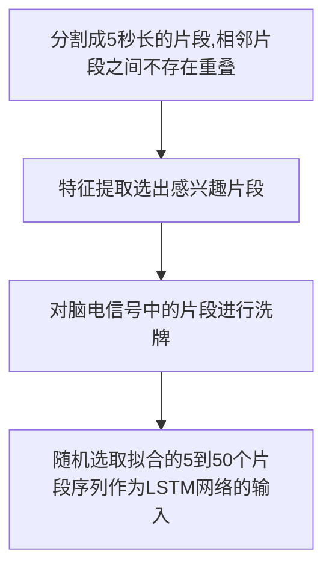

# EEG癫痫预测LSTM
| 论文名称 | A Long Short-Term Memory deep learning network for the prediction of epileptic seizures using EEG signals |
| -- | -- | 
| 期刊 | Computers in Biology and Medicine 6.698/Q1|
| 方法 | 本文将==长短时记忆LSTM网络==引入癫痫发作的脑电图信号预测中，扩展了深度学习算法与==卷积神经网络CNN==的应用。通过测试多个模块和存储单元层，初步进行了预分析，以找到LSTM网络的最佳架构。 |
| 结论 | 推荐选择==两层LSTM网络==来评估癫痫发作的预测性能，使用4个不同长度的前窗(15 min ~ 2 h)。LSTM模型利用了在分类前提取的广泛特征，包括脑电通道相互关联和图论特征之间的时域和频域特征，使其能够利用所有通道的数据，使准确率相较于其他方法有较大提升。 |


| 传统方法 | LSTM优势 |
| -- | -- | 
| RNN | LSTM网络能够更好地适应大序列的数据序列。|
| CNN | 由于EEG信号本质上是高度动态、非线性的时间序列数据，LSTM网络在分离不同状态下大脑活动的时间特征方面优于CNN|

## 数据处理
### 数据来源
来自CHB-MIT头皮脑电图数据库，随机选取的三个病例的脑电图数据评估LSTM架构;
| 指标 | 数值 | 
| -- | -- | 
| 采样频率 | 每秒256次 |
| 分辨率 | 16位|
| epoch时长 | 大部分被分割为1 h长|
### 数据处理

为了克服类别不平衡的问题，但仍然使用所有可用的脑电图数据来进行更完整的评估，发作间期脑电图信号被分成更小的组，这些组与发作前的持续时间相匹配。如果发作间期类别的亚组划分导致剩余的结果，则从完整的发作间期亚组中随机选择脑电图片段，以填补剩余脑电图片段所需的缺失数据比例(即对最后一个发作间期亚组进行过采样)。利用发作前类与发作间类各亚群之间的分类结果均值估计总发作预测性能。
#### 总体流程




#### 特征表
脑电图信号分析中最常用的各种特征从每5秒长的脑电图段(即1280个脑电图数据样本)中提取，作为LSTM分类器的输入。提取的特征如下所示
| 范围  |  描述 | 具体  |
| -- | -- | -- |
| 时域 {rowspan=5 }| 统计矩 | 均值，方差，偏度，峰度 |
||标准偏差|方差平方根|
||零交叉|符号变化的次数|
||峰峰值电压|最高/最低振幅之间的差异|
||信号总面积|信号下绝对面积|
| 频域{rowspan=3 }|快速傅里叶变换|脑电信号总能量|
||功率谱密度||
||离散小波变换|以Daubechies 4 (db4)为母小波，7-level分解系数|
| 相关{rowspan=2 }|互相关|绝对互相关值，见下文|
||自相关|解相关时间|
|图论 {rowspan=2 }|本地测量|聚类系数、局部效率、中间中心性、离心率|
||全局测量|全局效率，直径，半径，特征路径|
 [==从每个5秒长的脑电图片段中提取的完整特征列表==]
#### 统计矩
::: tip
在进入发作前状态时，有显著的变化，与它们各自的发作期值相比，方差和去相关时间减少，而峰度在发作期时增加。
:::
#### 频域

|频域方法|原因|
|--|--|
|==离散傅里叶变换DFT==|考虑了脑电图信号的频谱信息，因为还提取了各种频域特征，包括总能谱和基本节律带的能量百分比。利用DFT提取各频段的脑电信号能量。|
|==离散小波变换DWT==|在DFT的基础上进行DWT，以(db4)为母小波，采用7层分解的，提取细节D和逼近系数(< 1hz)，因为允许分离最主要的伪像占据的1hz以下。7级分解是根据CHB-MIT数据库时使用的256hz采样频率来选择的，因为这是覆盖基本频带所需的最小深度。|

#### 绝对互相关值
采用最大绝对互相关值作为功能连接度量，进一步计算每对脑电通道的绝对互相关值，以量化任意两个脑电信号之间的相似性。它的优点在于它考虑了两个空间距离信号之间引入的潜在时间延迟。
$$ C_{x y}=\max _{\tau}\left(\left|\frac{C_{x y(\tau)}}{\sqrt{C_{x}(0) \cdot C_{y}(0)}}\right|\right) $$
#### 图论
|本地测量|对节点i计算并描述提取的局部测度如下|
|--|--|
|聚类系数|即该节点周围的邻居连接密度|
|局部效率|另一种隔离度量，定义为节点i邻居上的平均逆最短路径长度|
|中间度中心性|定义为任意两个节点k和l通过I的最短路径数除以两个节点之间最短路径总数|
|偏心度|表示从节点I到网络中任何其他节点的最长路径|
---

|全局测量|所提取的全局图测度|
|--|--|
|特征路径长度|定义为网络中平均最短路径长度，路径长度越短表示函数集成越好|
|全球效率|衡量的是网络的整体效率。
|直径|是节点的最大偏心(最长最短路径)，上界为n - N~leaf~ + 1，其中Nleaf是网络中叶子节点的数量(即没有任何连接的节点)|
|半径|是最小的偏心(较小的半径反映更多的中心网络拓扑)|


## 网络框架


### LSTM架构


|网络|描述|
|--|--|
|LSTM_1架构|采用最简单的方法，网络由32个存储单元的单层组成。|
|LSTM_2架构|存储单元的数量增加到128个，保持了单层的方法。|
|LSTM_3架构|存储单元的数量保持在128，但也包含了另一层等维的存储单元。|
|全连接层|所有网络后面都有一个使用relu激活函数输出30个单元的全连接层|
|最终密集层|使用“softmax”激活输出二进制分类的结果(即preictal发作前或interictal发作间)|

|模型评估|10倍交叉验证的分层方法|
|损失函数|交叉熵损失函数|
|优化器|使用Adam优化器(学习率0.001，β~1~=0.9，β~2~=0.999，衰减=0)|

加入中间dropout层，对分类性能没有显著影响。评估的dropout为0.2和0.5。

## 结论
### LSTM结构选择
前置窗口的持续时间设置为15分钟。在LSTM输入片段数为（5 - 50）的情况下，LSTM输入大小为643 * （5 - 50）特征。结果如图所示。

::: tip 总体比较
首先，结果证实了使用更复杂的2层网络的预期优势，因为总体而言，LSTM_3提供了最好的分类精度，特别是在案例2和14中。
:::
::: tip 局限
对于LSTM输入的大小，三种情况都可以看出，如果网络不够大，不能处理额外的信息量，增加作为输入的脑电图片段的数量不一定是有益的，因为LSTM_1和LSTM_2会很快饱和，导致分类精度降低。
::: 
:::tip 提高

在相同的背景下，当使用少量的脑电图段(小于20段)作为LSTM网络的输入时，以LSTM_3的形式增加了网络的复杂性，但由于考虑的脑电图数据量有限，对发现隐藏连接没有显著影响。只有当输入脑段数增加到20 ~ 30个左右时，更复杂的LSTM_3网络才能充分发挥其潜力，并提供更高的分类精度。
:::
### LSTM效果


|符号|含义|
|--|--|
|真阳性率(TP)|由正确识别为发作前脑段的片段数定义|
|真阴性(TN)|由正确分类为发作间期脑段的片段数定义|
|假阳性(FP)|由错误分类为发作间期脑段的片段数定义|
|假阴性(FN)|由错误分类为发作间期脑段的片段数定义|
|SEN|敏感度计算为TP/(TP+FN)|
|SPEC|特征度计算为TN/(TN+FP)|
|FPR|错误预测率|
```js
// --echarts--
function (chart) {
chart.setOption({
    // backgroundColor: '#2c343c',

    title: {
        text: '15分钟窗口传统分类器性能',
        left: 'center',
        top: 0,
        textStyle: {
            color: '#888'
        }
    },
    legend: {top: 30,},
    tooltip : {
        trigger: 'axis',
        axisPointer: {
        type: 'shadow'
        }
    },
    toolbox: {
        show: true,
        orient: 'vertical',
        left: 'right',
        top: 'center',
        feature: {
        mark: { show: true },
        dataView: { show: true, readOnly: false },
        magicType: { show: true, type: ['line', 'bar', 'stack'] },
        restore: { show: true },
        saveAsImage: { show: true }
        }
  },
    dataset: {
          // 提供一份数据。
          source: [
              ['MSE', '灵敏度', '特征值'],
              ['LSTM', 99.3, 98.79],
              ['DT', 88.68, 89.02],
              ['RIPPER',89.36,89.9],
              ['SVM', 89.37, 91.55],
          ]
      },
    xAxis: {type: 'category'},
    yAxis: {type: 'value'},
    series: [
        {
            type: 'bar',
            emphasis: {
                focus: 'series'
            },
            itemStyle: {
              normal: {
                label: {
                  show: true, //开启显示
                  position: 'top', //在上方显示
                  textStyle: {
                    //数值样式
                    color: 'black',
                    fontSize: 12,
                  },
                },
              },
            }, 
          },
        {
            type: 'bar',
            emphasis: {
                focus: 'series'
            },
            itemStyle: {
              normal: {
                label: {
                  show: true, //开启显示
                  position: 'top', //在上方显示
                  textStyle: {
                    //数值样式
                    color: 'black',
                    fontSize: 12,
                  },
                },
              },
            }, 
          },
         
      ]
}, true)
}
```
```js
// --echarts--
function (chart) {
chart.setOption({
    // backgroundColor: '#2c343c',

    title: {
        text: '神经网络分类器性能',
        left: 'center',
        top: 0,
        textStyle: {
            color: '#888'
        }
    },
    legend: {top: 30,},
    tooltip : {
        trigger: 'axis',
        axisPointer: {
        type: 'shadow'
        }
    },
    toolbox: {
        show: true,
        orient: 'vertical',
        left: 'right',
        top: 'center',
        feature: {
        mark: { show: true },
        dataView: { show: true, readOnly: false },
        magicType: { show: true, type: ['line', 'bar', 'stack'] },
        restore: { show: true },
        saveAsImage: { show: true }
        }
  },
    dataset: {
          // 提供一份数据。
          source: [
              ['MSE', '灵敏度', 'FPR'],
              ['120min-LSTM', 99.84,0.02],
              ['10min-Khan-CNN', 83.33,0.147],
              ['120min-Alotaiby-LDA',87,0.4],
              ['5min-Truong-CNN', 81.2,0.16],
          ]
      },
    xAxis: {
    type: 'category',
    axisLabel: { interval: 0, rotate: 30 }
  },
    yAxis: {type: 'value'},
    series: [
        {
            type: 'bar',
            emphasis: {
                focus: 'series'
            },
            itemStyle: {
              normal: {
                label: {
                  show: true, //开启显示
                  position: 'insideTop', //在上方显示
                  textStyle: {
                    //数值样式
                    color: 'pink',
                    fontSize: 12,
                  },
                },
              },
            }, 
          },
        {
            type: 'bar',
            emphasis: {
                focus: 'series'
            },
            itemStyle: {
              normal: {
                label: {
                  show: true, //开启显示
                  position: 'top', //在上方显示
                  textStyle: {
                    //数值样式
                    color: 'black',
                    fontSize: 12,
                  },
                },
              },
            }, 
          },
         
      ]
}, true)
}
```


## 补充

### 特征提取方法
| 论文名称 | Feature selection in high dimensional EEG features spaces for epileptic seizure prediction |
| -- | -- | 
| 期刊 | The International Federation of Automatic Control Milano (Italy) |
| 方法 | 本文分析了各种特征提取方法所产生的高维特征空间，用于癫痫发作的预测。将最小冗余最大相关性(mRMR)特征选择算法与支持向量机(SVMs)体系结构相结合，研究了用于癫痫发作预测的最佳特征集。 |
| 结论 |基于mRMR计算的子集指向不同的电极组合，没有特定的模式，例如:焦点位置和所选通道之间没有明显的匹配。所选择的通道不局限于任何特定区域，这可能表明了机器学习研究中发作区以外区域的重要性。使用这种方法，特定的特征(尤其是相对功率和小波系数)比其他方法更重要，只有一位患者呈现了研究中所选择的所有电极配置的特征。这些发现表明了个性化的、针对患者的解决方案的重要性;每个病人都需要特定的特征和电极组合。另一个重要方面与患者之间计算模型的可变性有关。|


| 特征 | 描述 | 
| -- | -- | 
| 能量| 信号能量 |
| 自回归模型误差 | 向前自回归预测误差|
| 解相关时间| 自相关序列的第一次过零|
|相对能量|不同频段的信号功率:δ频段(0.1 - 4Hz);θ波段(4 8Hz);波段(8 -15Hz);Beta波段(15 - 30Hz);伽玛波段(30 - 2000Hz)|
|光谱边缘|频率和功率，描述了最小频率和相关功率，其中高达50%的40Hz的光谱功率包含在信号中|
|统计时刻|脑电信号的均值、方差、偏度和峰度的统计分析|
|Hjorth|复杂性和流动性|
|小波变换系数|对脑电图信号进行6波段分解;用小波系数描述的时间序列的幂|
|平均相位相干性|两个通道之间相位同步的度量|

最小冗余最大相关性(mRMR)算法，对一组特征进行排序，使子集特征之间的冗余最小化，同时使特征的相关性最大化。这个想法是最小化根据相关性度量选择的子集的冗余。mRMR算法的第一步是基于f检验作为相关性度量，并计算特征之间的Pearson相关性作为冗余度量。在选择第一个特征，即与目标相关性最大的特征(f-test排名集)后，根据mRMRscore迭代选择剩余的特征集。
$$ m R M R s c o r e=\max _{i \in \Omega S}\left\{F(i, s)-\left(\frac{1}{|S|} \sum_{j \in S}|c(i, j)|\right)\right\} $$

