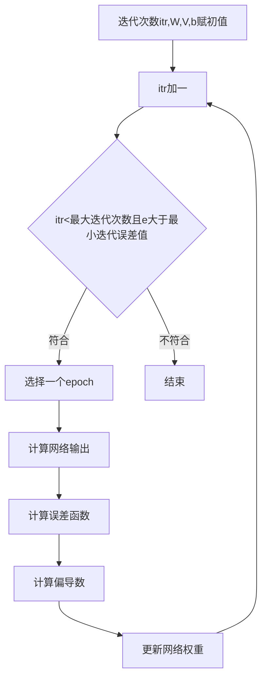

# 空间滤波网络SFN
| 论文名称 | A Neural Network-Based Optimal Spatial Filter Design Method for Motor Imagery Classification |
| -- | -- | 
| 期刊 | PLOS ONE 3.752/Q2|
| 方法 | 本文提出的空间滤波网络由空间滤波层和分类器层两层组成。这两层通过非线性映射函数相互联系。在SFN中，我们的目标是最大化类间方差，最小化类内方差，同时优化空间滤波器和分类器。为了对运动想象脑电信号进行分类，我们修改了众所周知的前馈结构，并推导了与所提出的结构相对应的前向和后向方程。 |
| 结论 | 结果表明，SFN是一种较好的运动想象脑电信号分类方法，具有较高的分类精度。|
---

在SFN中，训练集中的每个历元都交给网络来学习最优空间滤波器，而CSP对每个类只使用一个平均协方差矩阵。此外，SFN的训练目的是直接提高分类精度，而CSP方法的目的是最大化给定的优化函数，这间接提高了分类精度。
|CSP|描述|
|--|--|
|CSP的缺陷①|==CSP的目标是最大化类间方差，而忽略类内方差的最小化。因此，使用CSP方法得到的特征可能会有较大的类内方差。==|
|CSP的缺陷②|脑电图信号的协方差矩阵可能会随着时间的推移而变化，仅用一个平均协方差矩阵来表示训练集中一个类的所有时刻，将导致不准确的空间滤波器|
|CSP的缺陷③|CSP方法的最大化优化函数是间接的提高分类精度，因为CSP方法之后还会使用一个独立的分类器，所以不是直接提高精度|
|CSP的缺陷④|其严格的适应度函数。CSP不允许不同类型的适应度函数，这可能在不同的情况下更有用。CSP试图优化瑞利商，即两个类的平均方差之比，这对异常值非常敏感，导致过拟合|
## CSP
找到方向(即空间滤波器，利用矩阵的对角化，找到一组最优空间滤波器进行投影)，使一个类的方差最大化，同时使另一个类的方差最小化，使得两类信号的方差值差异最大化，从而得到具有较高区分度的特征向量。

一个epoch表示为：
$$X_{C, i} \in R^{N\times T}$$
|符号|描述|
|--|--|
|C|是epoch的类|
|i|是属于C类的epoch号|
|N|是脑电通道数|
|T|是epoch的样本数|
$$ \vec{y}_{C, i}=\vec{w}^{T} X_{C, i}$$

$$ P_{C, i}=\vec{y}_{C, i} \vec{y}_{C, i}^{T}=\vec{w}^{T} X_{C, i} X_{C, i}^{T} \vec{w} $$
|符号|描述|
|--|--|
|$X_{C, i}$|是零平均信号(即带通滤波)，即CSP输入数据是经过带通滤波的|
|$\vec{w} \in R^{N\times 1}$|是n维空间中的一个向量|
|$\vec{y}_{C, i}\in R^{N\times 1}$|是$X_{C, i}$的投影|
|T|是转置运算|
|$P_{C, i}$|投影信号功率|
$$ R_{C, i}=\frac{X_{C, i} X_{C, i}^{T}}{\operatorname{tr}\left(X_{C, i} X_{C, i}^{T}\right)} \quad \bar{R}_{C}=\frac{1}{n_{C}} \sum_{i \in C}^{n_{C}} R_{C, i} $$
|符号|描述|
|--|--|
|$R_{C, i} \in R^{N\times N}$|为带通滤波信号$X_{C, i}$的协方差矩阵|
|$\bar R_{C} \in R^{N\times N}$|为C类的平均协方差矩阵|
|tr|为迹函数|
|$n_C$|为C中的epoch数|

$$ \bar{P}_{C}=\frac{1}{n_{C}} \sum_{i \in C}^{n_{C}} \vec{w}^{T} X_{C, i} X_{C, i}^{T} \vec{w}=\frac{1}{n_{C}} \sum_{i \in C}^{n_{C}} \vec{w}^{T} R_{C, i} \vec{w}=\vec{w}^{T} \bar{R}_{C} \vec{w} $$
|符号|描述|
|--|--|
|$\bar P_{C}$|C类的平均功率|
CSP在投影的w轴上搜索类的最大功率比。因此，一类的平均功率是最大的，而另一类的平均功率是最小的。所以，空间过滤器应该最大化以下内容
$$ \arg \max _{\vec{w}} \frac{\vec{w}^{T} \bar{R}_{1} \vec{w}}{\vec{w}^{T} \bar{R}_{2} \vec{w}} $$
对于任意使上式最大化的$\vec w$，可以通过标量系数将分母设为常数c，而不改变比例。因此，瑞利商的最大化问题可以重新转化为约束优化问题:
$$ maximize  \quad \vec{w}^{T} \bar{R}_{1} \vec{w}$$
$$subject to \quad \vec{w}^{T} \bar{R}_{2} \vec{w}=c $$
上述约束优化问题可用拉格朗日乘子法求解
$$ L(\lambda, \vec{w})=\vec{w}^{T} \bar{R}_{1} \vec{w}-\lambda\left(\vec{w}^{T} \bar{R}_{2} \vec{w}-c\right) $$
$$ \frac{\partial L(\lambda, \vec{w})}{\partial \vec{w}}=2 \vec{w}^{T} \bar{R}_{1}-\lambda\left(2 \vec{w}^{T} \bar{R}_{2}\right)=0 $$
式中λ为拉格朗日乘子。因为$\bar R_{C}$是一个对称矩阵，上面的方程可以写成标准的特征值问题:
$$ \left(\bar{R}_{2}^{-1} \bar{R}_{1}\right) \vec{w}=\lambda \vec{w} $$
空间滤波器$W_{CSP}$矩阵由M = 2m构成,对应m个最大和m个最小特征值的特征向量:
$$
W_{C S P}=\left[\vec{w}_{\lambda_{1}}, \ldots \vec{w}_{\lambda_{m}} \ldots \ldots \vec{w}_{\lambda_{N-m+1}}, \ldots \vec{w}_{\lambda_{N}}\right]^{T}
$$

$$
Z_{C, i}=W_{C S P} X_{C, i}
$$
式中$Z_{C, i}$为空间滤波信号。频带功率(方差)作为分类器的特征。对于epoch i，CSP特征向量由下式给出
$$ f \overrightarrow{c s} p_{C, i}^{k}=\log \left(\frac{\operatorname{var}\left(Z_{C, i}^{k}\right)}{\sum_{l=1}^{2 m} \operatorname{var}\left(Z_{C, i}^{l}\right)}\right) k=1,2, \ldots M $$
方差比的对数是用来计算特征的分布近似于一个正态分布。接下来，利用这些特征训练线性分类器。
## OVR-CSP
针对两个类定义了CSP的优化函数。当有两个以上的运动表象类(如，左手、右手、脚、舌头等)时，CSP方法需要进行一些修改。将CSP扩展到多类是通过类的组合实现的，可以将一个多类问题转换为几个二进制问题，或者计算一个类与所有其他类的CSP，称为one versus the Rest (OVR) CSP，其目标是最大化一个类相对于其他类的总能力。c类的OVR-CSP计算如下:
$$ \vec{w}_{c}=\underset{\vec{w}}{\arg \max } \frac{\vec{w}^{T} \bar{R}_{c} \vec{w}}{\sum_{j \neq c}^{C} \vec{w}^{T} \overline{R_{j}} \vec{w}} $$
## SFN
### 空间滤波网络(SFN)的结构

SFN由一个==空间过滤层==(layer -1)和一个==分类层==(layer -2)组成，它们通过非线性映射函数相互连接。第一层由空间滤波矩阵W和特征提取函数组成。空间滤波器层的输入输出关系如下:
$$ y_{m}(t)=\frac{\sum_{n=1}^{N} W_{n m} \vec{x}(t)}{\sqrt{\sum_{n=1}^{N} W_{n m}^{2}}}=\frac{\vec{w}_{m}^{T}}{\left\|\vec{w}_{m}\right\|} \vec{x}(t) $$
|符号|描述|
|--|--|
|$\vec{x}(t)$|是EEG时期t时刻的输入数据，有N个通道和t个样本|
|$\vec{w}_m \in R^{N\times 1}$|是空间滤波矩阵的第$m^{th}$列|
|$y_{m}(t)$|是$m^{th}$空间滤波器在t时刻的输出数据|
|$\frac {\vec{w}_{m}} {\left\|\vec{w}_{m}\right\|}$|以确保输入信号用单位范数滤波器进行空间滤波|

### 单位半径超球表面搜索最优空间滤波器的示意图

SFN在N维超球表面上搜索最优空间滤波器。训练算法按$\vec {d_w}$移动$\vec {w_m}$，实际上是在超球上移动空间滤波器。经过空间滤波阶段后，Layer-1计算特征向量作为Layer-2的输入。$\widehat{f_{m}}$是给定epoch的特征向量。
$$ \widehat{f_{m}}=\log \left(\operatorname{var}\left(\vec{y}_{m}\right)\right)=\log \left(\frac{1}{T} \sum_{t=1}^{T}\left(y_{m}(t)-\mu_{\vec{y}_{m}}\right)^{2}\right) \quad m=1,2, \ldots M $$
在CSP中使用对数来近似特征的分布到正态分布,SFN的第2层是分类层。一个m维的输入特征向量(f) i映射到一个o维的输出向量z。第二层的输入输出关系如下:
$$ \begin{aligned} \vec{z} &=V^{T} \vec{f}+\vec{b} \\ \vec{\phi} &=\tanh (\vec{z}) \end{aligned} $$

|符号|描述|
|--|--|
|V|是权重矩阵|
|$\vec{b}$|是偏置向量|
|tanh()|是用于将$\vec{z}$转换到(−1，+ 1)范围的正切双曲函数|
|$\vec{\phi}$|是网络输出|
对于二元和多类别的情况，输入epoch $X^k$的标记是不同的。对于两类(二进制)的情况，使用单个输出神经元(O = 1)和一个阈值。因为tanh被用作激活函数，所以阈值将为0。对于多类的情况，输出神经元的数量应该等于类的数量(O = C)，在这种情况下，通过在所有输出神经元中选择$\vec{\phi}$值最大的输出神经元来分配一个输入epoch $X^k$的类标签。
$$ \operatorname{Class}\left(X^{k}\right)=\arg \max \left(\overrightarrow{\phi_{c}^{k}}\right) \quad c=1,2, \ldots C $$
## 训练
### 方法
使用==Backpropagation==和==Levenberg-Marquardt==两种方法来训练SFN。两种方法都使用==偏导数==来优化空间滤波系数$W_{ij}$。
- 对于Backpropagation方法，系数在每个历元呈现给SFN后更新.
- 而对于Levenberg-Marquardt方法，在训练集中所有的历元呈现给网络后更新。
 
对于这两种方法，误差函数都是根据网络的输出和呈现给网络的历元类标签来计算的。
此外，W、V和 $\vec b$ 的初始权值按σ = 0.1和μ = 0的正态分布随机设定。
### 误差函数
SFN需要一个误差函数E来优化空间滤波器$W_{nm}$和分类器系数$V_{mo}$。当SFN成功区分训练集中的不同类时，E应为最小值。采用目标类向量$\vec T_c$与SFN输出向量$\vec z$之间的欧氏距离作为误差度量。第k个epoch的误差值为:
$$ E^{k}=\frac{1}{2} \sum_{0=1}^{o}\left(e_{o}^{k}\right)^{2}=\frac{1}{2} \sum_{o=1}^{o}\left(\vec{\phi}_{o}^{k}-\vec{D}_{o}^{k}\right)^{2} \quad, 1 \leq k \leq K $$
对SFN进行迭代训练，使训练类的网络总误差最小化。
|符号|描述|
|--|--|
|k|为当前给SFN的历元数|
|${\phi_{o}^{k}}$|为SFN的$o^{th}$输出|
|${D_{o}^{k}}$|为给网络第k个历元时目标向量的另一个元素|
|K|为训练集中的总历元数|
### BP反向传播
反向传播方法。反向传播(Backpropagation, BP)方法利用神经网络的所有权值来最小化属于模式识别问题的一组向量的误差。BP学习规则基于==梯度下降法==。权值用随机值初始化，并在一个方向上改变，以减少错误。

在本研究中，使用BP方法对空间滤波层和分类器层进行优化。在经典的模式识别问题中，给前馈神经网络一个特征向量，并根据特征的类别和网络的输出更新网络的权值。

然而，所提出的训练方法接受一个历元中的所有样本，并在一个历元完全给定网络时更新权值。对于每一层，SFN的学习规则如下:
$$ W_{n m}=W_{n m}-\mu \frac{\partial E}{\partial W_{n m}} $$
$$ V_{m o}=V_{m o}-\mu \frac{\partial E}{\partial V_{m o}} $$
$$ \vec{b}_{o}=\vec{b}_{o}-\mu \frac{\partial E}{\partial \vec{b}_{o}} $$
其中$V_{mo}$和$W_{nm}$分别为分类器层和空间滤波器层的权值，bo为网络第二层的偏置值，μ为学习率参数。利用链式法则计算每一层的==偏导数==:
$$ \frac{\partial E}{\partial V_{m, o}}=\frac{\partial E}{\partial \vec{\phi}_{o}} \frac{\partial \vec{\phi}_{o}}{\partial \vec{z}_{o}} \frac{\partial \vec{z}_{o}}{\partial V_{m, o}} $$
$$ \frac{\partial E}{\partial \vec{b}_{o}}=\frac{\partial E}{\partial \vec{\phi}_{o}} \frac{\partial \vec{\phi}_{o}}{\partial \vec{z}_{o}} \frac{\partial \vec{z}_{o}}{\partial \vec{b}_{o}} $$
$$ \frac{\partial E}{\partial W_{n, m}}=\sum_{o=1}^{O} \frac{\partial E}{\partial \vec{\phi}_{o}} \frac{\partial \vec{\phi}_{o}}{\partial \vec{z}_{o}} \frac{\partial \vec{z}_{o}}{\partial \vec{f}_{m}} \sum_{t=1}^{T} \frac{\partial \vec{f}_{m}}{\partial \vec{y}_{m}(t)} \frac{\partial \vec{y}_{m}(t)}{\partial W_{n, m}} $$
注意，任何输出的错误都会传播到空间过滤器层中的所有权值。由于分类器层输出和误差值是在一个epoch内的所有样本统计完毕后计算的，所以需要在SFN完全呈现epoch后计算反向传播。所需要的反向方程(导数)如下
$$ \frac{\partial E}{\partial \vec{\phi}_{o}}=\vec{\phi}_{o}-\vec{D} $$
$$ \frac{\partial \vec{\phi}_{o}}{\partial \vec{z}_{o}}=1-\left(\vec{\phi}_{o}\right)^{2} $$
$$ \frac{\partial \vec{z}_{o}}{\partial V_{m, o}}=\vec{f}_{m} \quad \frac{\partial \vec{z}_{o}}{\partial \vec{f}_{m}}=V_{m, o} \quad \frac{\partial \vec{z}_{o}}{\partial \vec{b}_{o}}=1 $$
$$ \frac{\partial \vec{f}_{m}}{\partial \vec{y}_{m}(t)}=\frac{1}{\frac{1}{T} \sum_{t=1}^{T}\left(\vec{y}_{m}(t)\right)^{2}} \frac{2}{T} \vec{y}_{m}(t) $$
$$ \frac{\partial \vec{y}_{m}(t)}{\partial W_{n m}}=\frac{\left\|\vec{w}_{m}\right\| \vec{x}_{n}(t)-W_{n m} \vec{y}_{m}(t)}{\left\|\vec{w}_{m}\right\|^{2}} $$
#### 计算流程

#### 训练过程
网络参数如下:BP法 μ = 10^−3^

## 结果
### 二分类

|图片|描述|
|--|--|
|a|其中Xk是第k个epoch。每个红色(圆圈)和蓝色(加号)点分别代表第1类或第2类的epoch。表示二维输入数据的对数方差特征。注意，每个点代表属于第1类(红色圆圈)或第2类(蓝色加号)的epoch。|
|b|由主分量计算的输入数据用椭圆括起来。注意，输入数据在每个维度上都有相同的方差。|
|c|展示了SFN空间滤波层的效果，空间滤波层成功地将两类分离。这里，黑色虚线显示了SFN分类器层创建的类间边界。|
|d|封闭的椭圆表示经过空间过滤的输入数据(y)。其中属于任何类的特征在一个维度上的方差最大，而在另一个维度上的方差最小。|
### 多分类

|图片|描述|
|--|--|
|a|二维输入数据的对数方差特征。请注意，每个点代表属于第1类(红色圆圈)、第2类(蓝色加号)、第3类(绿色星号)或第4类(黄色叉号)的epoch。|
|b|括起来的省略号表示输入数据。|
|c|SFN空间滤波器层输出(f)带有分类器层生成的类边界(黑色虚线)。|
|d|封闭的椭圆表示经过空间过滤的输入数据(y)。|

### 与OVR-CSP比较
由于OVR-CSP不接受任何超参数，且不需要初始权值设置，所以每次运行算法，OVR-CSP的精度都是==恒定==的。然而，由于初始权值的设置是==随机==的，因此在每次运行SFN时，得到的精度是不同的。因此，我们使用箱线图来绘制SFN的准确率，其中箱边界代表输入数据的上、下25%分位数(排除异常值)，对每个用户和m值运行30次得到该算法。方框内的粗体线表示中值。注意，OVR-CSP的空间过滤器(M)的总数是类数量的倍数。

虽然分类准确率在不同的被试之间存在显著差异，但很明显，SFN提高了==两个数据集==中大多数被试的分类准确率。
::: tip 
可以通过更好、更稳健地==选择初始网络权值==来改善，从而不断提供更高的结果。然而，提高初始权值选择的鲁棒性超出了本文的范围。
:::