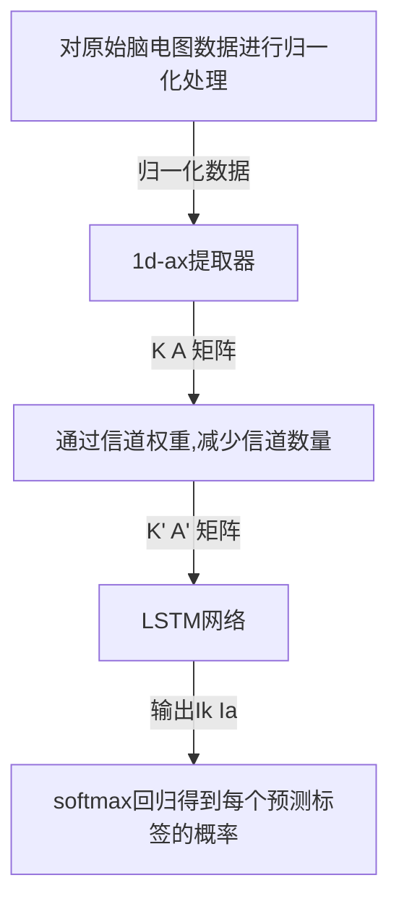
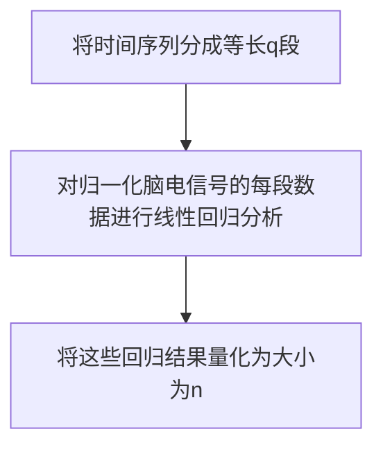

# 基于LSTM的MI脑电分类
| 论文名称 | LSTM-Based EEG Classification in Motor Imagery Tasks|
| -- | -- | 
| 期刊 | IEEE TRANSACTIONS ON NEURAL SYSTEMS AND REHABILIT A TION ENGINEERING 4.528/Q1|
| 方法 | 在本文中，我们将开发一个基于lstm的框架来提取时变脑电信号的基本特征。为了提高本文提出的基于LSTM的框架的泛化性能，减少过拟合的可能性，本文还采用了1 - ax和信道加权技术，使脑电信号表示更加简洁，从而方便了LSTM网络的后续训练。信道加权系数可以与LSTM网络的其他网络参数一起自动优化。|
| 结论 |提出的AX-LSTM具有良好的分类性能。对于在线分类，可以通过采集不同受试者的脑电图数据对整个网络进行离线训练。然后由新的脑电片段进行反馈，输出预测标签的概率。该方法的参数尺度远小于其他深度网络，实时性处理更快，过拟合风险小。 |
---
|网络|方法|
|--|--|
|CNN|到目前为止，很难找到一种有效的转换方法，将EEG信号以一种携带所有适合CNN的信息的形式表达出来。|
|RNN|对于RNN来说，使用梯度下降算法训练网络仍然是一个挑战。RNN的另一个困难是它对之前输入到网络的输入不敏感。|

|特征|公式|
|--|--|
|平均值|$\mu=\frac{1}{N} \sum_{i=1}^{N} \hat x_{i}$|
|方差|$\sigma^{2}=\frac{1}{N} \sum_{i=1}^{N}\left ({w^T}[x_{i}-\mu]\right)^{2}$|
## 算法框架

## 归一化
$$ \hat{\mathbf{v}}_{i}=\frac{\mathbf{v}_{i}-\operatorname{mean}\left(\mathbf{v}_{i}\right)}{\operatorname{std}\left(\mathbf{v}_{i}\right)}, \quad i=1,2, \ldots, c $$

|符号|解释|
|--|--|
|$\hat X$|数据预处理$\hat{\mathbf{X}}=\psi(\mathbf{X})$|
|$\psi$|表示归一化操作，得到的归一化信号的均值和标准差分别为0和1。|
|$v_i$|表示$X$的第i行|
|$\hat v_i$|表示$\hat X$的第i行|
|mean(·)|平均值|
|std(·)|标准差|
## 1d-AX算法
在运动想象任务中，建议频带在8 - 35hz之间。然而，在实践中，准确的通带是与主体相关的，不准确的带通滤波可能会导致最终的分类精度下降。为了避免这一问题，本文提出的方法忽略了带通滤波。取而代之的是使用1d-AX
### 1d-SAX算法
1d-sax将时间序列分成等长的片段，并计算每个片段的平均值。但是，两个视觉上不同的区段可能有相同的平均值。为了实现更准确的表示，1d-sax进一步采用线段的斜率作为特征。
### 1d-SAX算法流程

### 1d-AX算法
为了简化计算，我们跳过了1 - sax中的第三步，即使用数值而不是符号。
利用最小二乘估计对各分段进行线性回归。
|符号|解释|
|--|--|
|$\hat v_i^{(j)}$|$\hat v_i$的第j段|

然后$\hat v_i^{(j)}$用一个线性函数$k_{i}^{(j)} \cdot t+b_{i}^{(j)}$近似
$k_{i}^{(j)}$和$b_{i}^{(j)}$可以通过最小化最小二乘近似来计算误差
$$ \left\|k_{i}^{(j)} \cdot \mathbf{t}_{i}^{(j)}+b_{i}^{(j)}-\hat{\mathbf{v}}_{i}^{(j)}\right\|_{2}^{2} $$
$t_{i}^{(j)}$表示在不同的时刻被采样,经过一些简单的操作，我们得到了
$$ \begin{aligned} k_{i}^{(j)} &=\frac{\sum_{k=1}^{q}\left(t_{i, k}^{(j)}-\bar{t}_{i}^{(j)}\right) \bar{v}_{i}^{(j)}}{\sum_{k=1}^{q}\left(t_{i, k}^{(j)}-\bar{t}_{i}^{(j)}\right)^{2}} \\ b_{i}^{(j)} &=\bar{v}_{i}^{(j)}-k_{i}^{(j)} \cdot \bar{t}_{i}^{(j)} \end{aligned} $$

在这一步之后，每个分段可以用两个参数k,b来近似表示$a_{i}^{(j)}=k_{i}^{(j)} \cdot \bar{t}_{i}^{(j)}+b_{i}^{(j)}$
将上述步骤应用于所有的环节${\hat{\mathbf{v}}_{i}^{(j)}}_{j=1}^{m}$那么可以得到
$$
\begin{aligned}

\mathbf{P}_{i} &=\left[\begin{array}{cccc}
k_{i}^{(1)} & k_{i}^{(2)} & \ldots & k_{i}^{(m)} \\
a_{i}^{(1)} & a_{i}^{(2)} & \ldots & a_{i}^{(m)}
\end{array}\right], \quad i=1, \ldots, c .
\end{aligned}

$$
因为每次试验都有c个通道，我们最终得到了c个矩阵。为了便于后面的讨论，我们进一步构造矩阵K和A

$$
\begin{aligned}
\mathbf{K} &=\left[\begin{array}{cccc}
k_{1}^{(1)} & k_{1}^{(2)} & \ldots & k_{1}^{(m)} \\
\vdots & \vdots & \ddots & \vdots \\
k_{c}^{(1)} & k_{c}^{(2)} & \ldots & k_{c}^{(m)}
\end{array}\right] \\
\mathbf{A} &=\left[\begin{array}{cccc}
a_{1}^{(1)} & a_{1}^{(2)} & \ldots & a_{1}^{(m)} \\
\vdots & \vdots & \ddots & \vdots \\
a_{c}^{(1)} & a_{c}^{(2)} & \cdots & a_{c}^{(m)}
\end{array}\right]
\end{aligned}
$$
原则上，在这一阶段可以进一步纳入更多的时域特征(如偏度和峰度)。但是，为了平衡系统的整体复杂性和分类性能，数据段的==平均值==和==斜率==被用作提议的框架的最基本特征。
### 效果
蓝线为原始EEG信号，红线为线性回归的近似结果。

## 信道加权
设Wk和Wa为加权矩阵。
$$ \mathbf{K}^{\prime}=\mathbf{W}_{k} \cdot \mathbf{K} $$
$$ \mathbf{A}^{\prime}=\mathbf{W}_{a} \cdot \mathbf{A} . $$
从本质上讲，要优化Wk和Wa中的加权系数，我们需要解决下面的优化问题
$$ \operatorname{minimize}_{\mathbf{W}_{k}, \mathbf{W}_{a}} J\left[\mathcal{F}\left(\mathbf{K}^{\prime}, \mathbf{A}^{\prime}\right)\right] $$
$w_ij$的梯度可以用下式表示
$$ \frac{\partial J}{\partial w_{i j}}=\sum_{n=1}^{m} \frac{\partial J}{\partial k_{i n}^{\prime}} \frac{\partial k_{i n}^{\prime}}{\partial w_{i j}}=\sum_{n=1}^{m} \frac{\partial J}{\partial k_{i n}^{\prime}} k_{j n} $$

|符号|解释|
|--|--|
|$\mathcal{F}$|表示信道加权后的正向传播|
|$J$|表示整个分类系统的代价函数|
|$w_{ij}$|是Wk的第(i, j)个元素|
|$k'_{in}$|表示$k'$的(i, n)元素|
|$k_{jn}$|表示$k$的(j, n)元素|
|$\frac{\partial J}{\partial k_{i n}^{\prime}}$|表示J的梯度|

## LSTM
信道加权后，将K和A作为时间序列，分别输入两个LSTM网络。实际上，K和A是由两个lstm同时处理的。

在时刻t, LSTM细胞产生$s_t$和$h_t$
$$ \begin{aligned} \mathbf{s}_{t} &=\mathbf{s}_{t-1} \circ \mathbf{f}_{t}+\mathbf{i}_{t} \\ \mathbf{h}_{t} &=\mathbf{o}_{t} \circ \tanh \left(\mathbf{s}_{t}\right) \end{aligned} $$
其中◦表示元件的乘法，ft, it和ot分别表示遗忘门，输入门和输出门的输出。
### 遗忘门
遗忘门决定了有多少st - 1的信息会被保留。遗忘门的输出由下式决定
$$ \mathbf{f}_{t}=\sigma\left(\mathbf{W}_{f} \cdot\left[\mathbf{h}_{t-1}, \mathbf{x}_{t}\right]+\mathbf{b}_{f}\right) $$
$W_f$是训练阶段待估计的系数,σ(·)表示由下式决定
$$ \sigma(z)=\frac{1}{1+e^{-z}} . $$
如果σ(·)的输入是一个向量，则对其输入向量的每个元素执行。在实际应用中，遗忘门bf的偏置一般由1初始化，这有利于单元保持原语信息。
### 输入门
输入门决定了xt和ht−1的信息在电流中保留多少，输入门的输出由下式决定
$$ \mathbf{i}_{t}=\mathbf{i}_{t}^{\prime} \circ \mathbf{s}_{t}^{\prime} $$
$$ \mathbf{i}_{t}^{\prime}=\sigma\left(\mathbf{W}_{i} \cdot\left[\mathbf{h}_{t-1}, \mathbf{x}_{t}\right]+\mathbf{b}_{i}\right) $$
$$ \mathbf{s}_{t}^{\prime}=\tanh \left(\mathbf{W}_{s} \cdot\left[\mathbf{h}_{t-1}, \mathbf{x}_{t}\right]+\mathbf{b}_{s}\right) . $$
tanh(·)表示由定义的双曲正切函数
$$ \tanh (z)=\frac{e^{z}-e^{-z}}{e^{z}+e^{-z}} $$
### 输出门
输出门决定隐含层ht的输出中保留st的多少信息。它的输出是
$$ \mathbf{o}_{t}=\sigma\left(\mathbf{W}_{o} \cdot\left[\mathbf{h}_{t-1}, \mathbf{x}_{t}\right]+\mathbf{b}_{o}\right) $$

## 训练
综上所述，给定K或A，有8组参数(W f和b f, Wi和bi, Ws和bs, Wo和bo)。LSTM网络的训练可以通过==时间反向传播==(BPTT)算法来完成
LSTM网络只能处理输入的1d-AX特征。为了实现脑电分类，我们还需要一个==softmax回归层==来预测每一类的概率。在处理二元分类问题时，会退化为逻辑回归。为了训练整个系统，我们采用==对数似然==代价作为最终代价函数
$$ L(\theta)=-\frac{1}{n}\left[\sum_{i=1}^{n} \sum_{j=1}^{n_{c}} \mathcal{I}\left(y_{i}=j\right) \log p\left(y_{i}=j \mid \mathbf{I} ; \mathbf{W}_{s f}\right)\right] $$
其中θ是包含所有待调参数的向量，n是脑电信号的试验次数，yi表示小批量第I个输入的预测标签，I(·)是指标函数，如果其参数为真，则取1，否则取0。为了避免验证阶段的过拟合，还可以在代价函数中加入正则项
$$ J=L(\theta)+\lambda \rho(\theta) . $$
注意，在实践中，并不是所有的参数θ都存在正则项ρ(θ)。为了降低过拟合的概率，我们在ρ(θ)中采用l1范数来实现稀疏解。
在LSTM细胞中，遗忘门b f的偏差初始设为1，以记住训练开始时的主要信息。LSTM细胞中的其他可调参数由均匀分布在[0,1]内的随机值随机初始化。

我们还采用了==dropout==来增强模型的泛化能力。具体来说，LSTM单元的栅极输出的每个单元都以固定的==p = 0.6==独立于其他单元。我们采用==自适应矩估计Adam==算法来最小化代价函数。学习率η= 0.001，一阶矩估计β1= 0.9和二阶矩估计β2= 0.9

## 结果
可以清楚地看到，除了组III的实验，AX-LSTM方法的表现优于其他方法。

由于网络框架的不同，不同的网络需要不同数量的参数,与其他网络相比，AX-LSTM需要更少的可调参数，这极大地降低了过拟合的风险。

