# Transformer

### Sj是decoder hi是encoder

### Query(匹配)表示用来匹配key值
### 拿qj去匹配所有K算出m个权重aj

### Wk和Wq Wv是权重参数,用训练数据来学习

### 这里转置后K:就成了K矩阵的行向量，然后与q: j计算内积，从几何上就能得到内积越大的向量相似度越高

## Attention without RNN
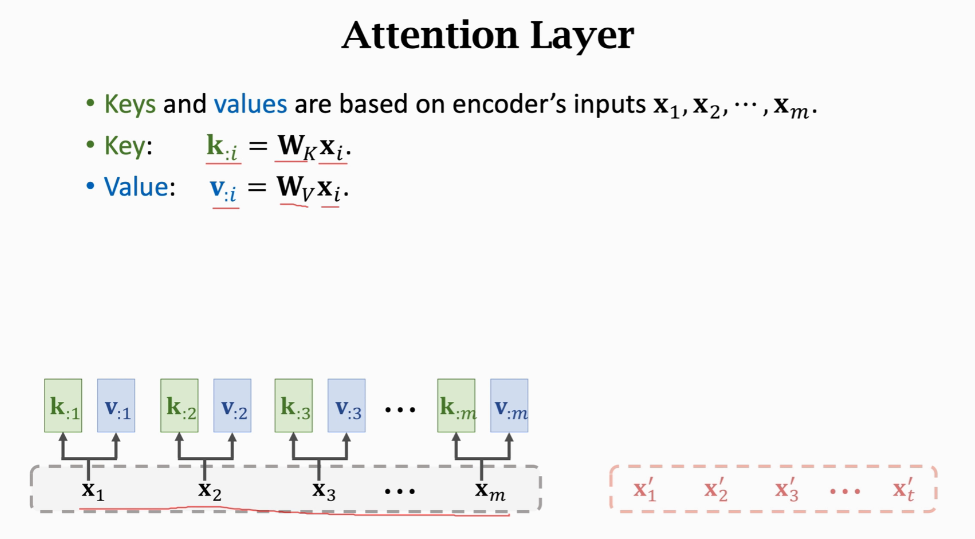
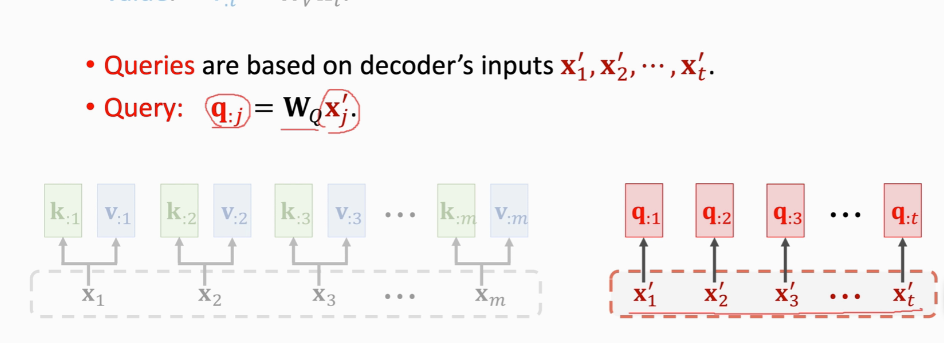

把xj映射到qj
一共Wk Wv Wq三个权重参数
权重a计算
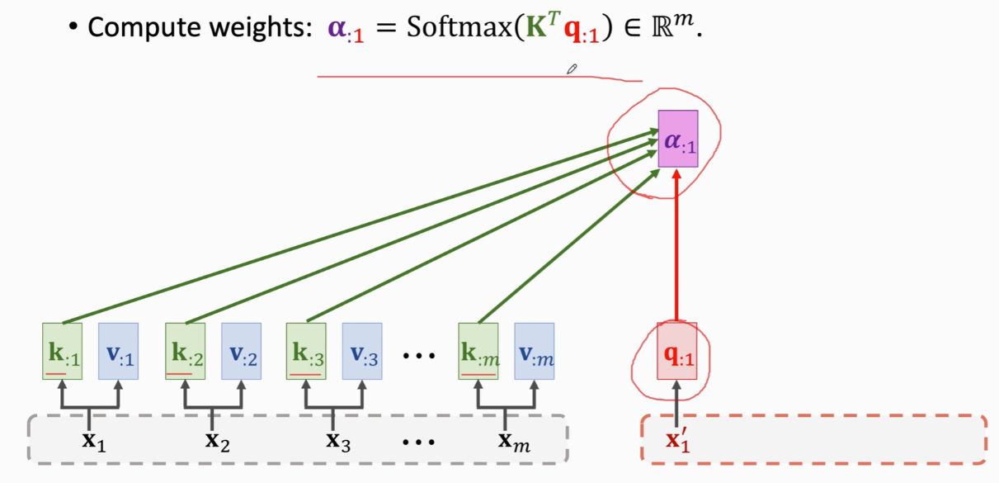
加权平均c
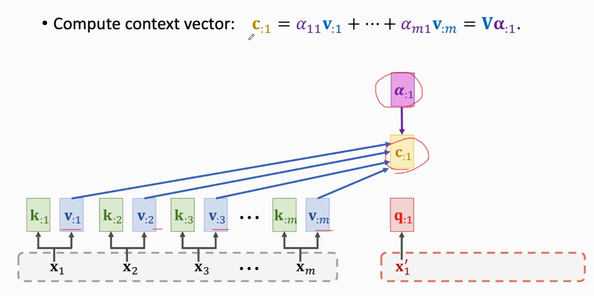
x与c的个数一样
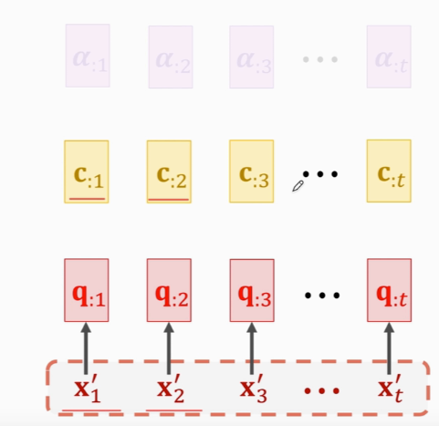
cj是列向量
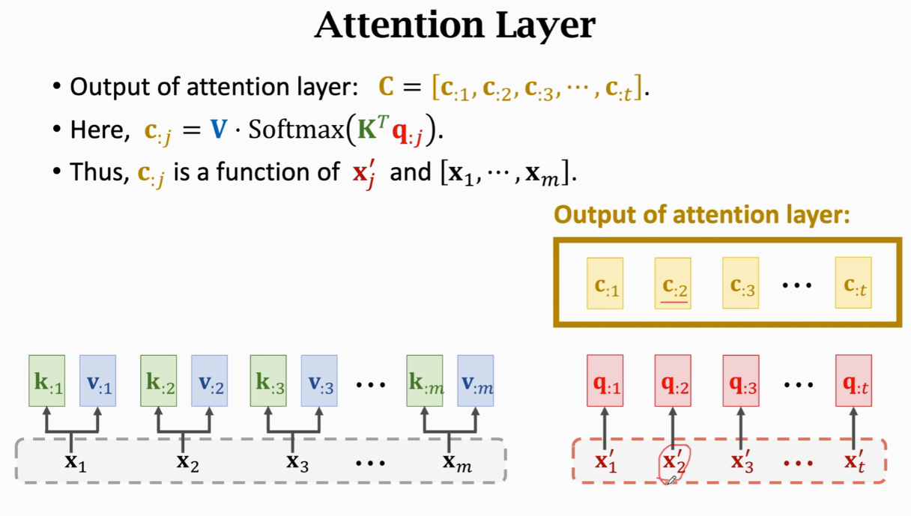
RNN的话,会把h作为特征向量,attention是c,而c是知道整句英语的
p2抽样得到第三个德语单词x3
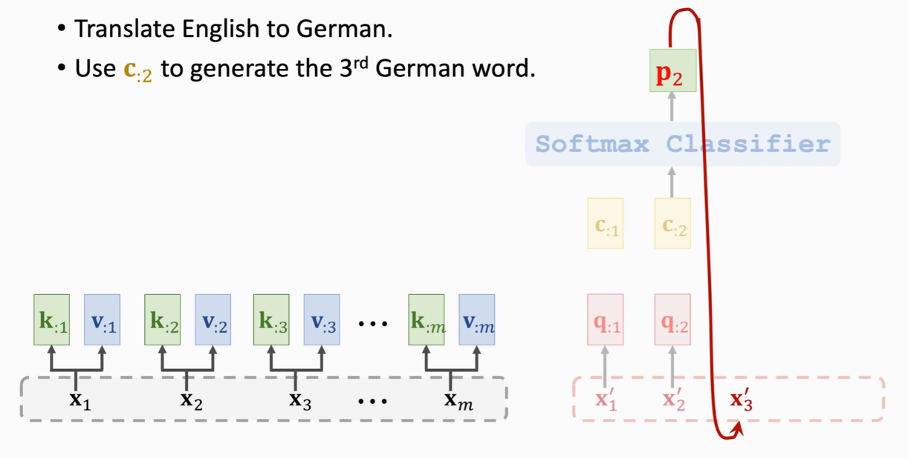
attention输出是c
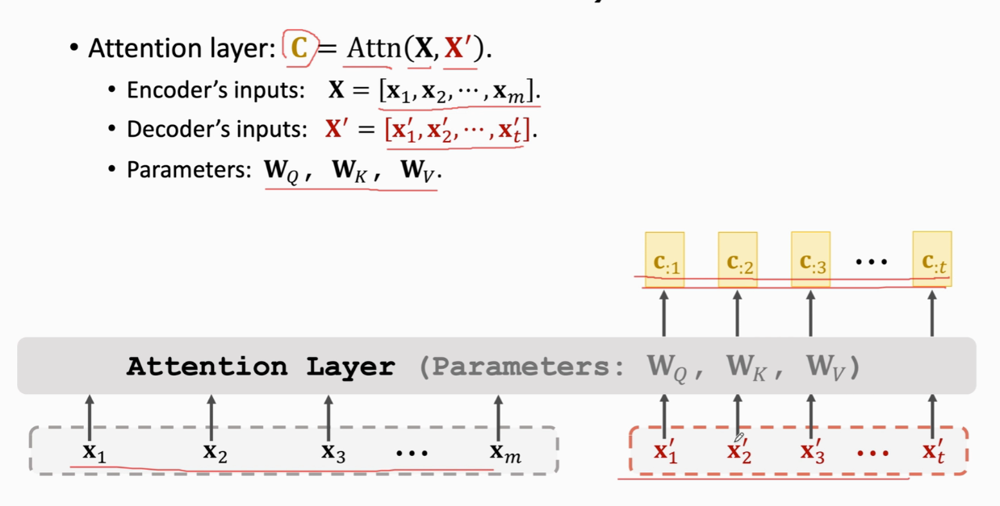

Self-Attention without RNN
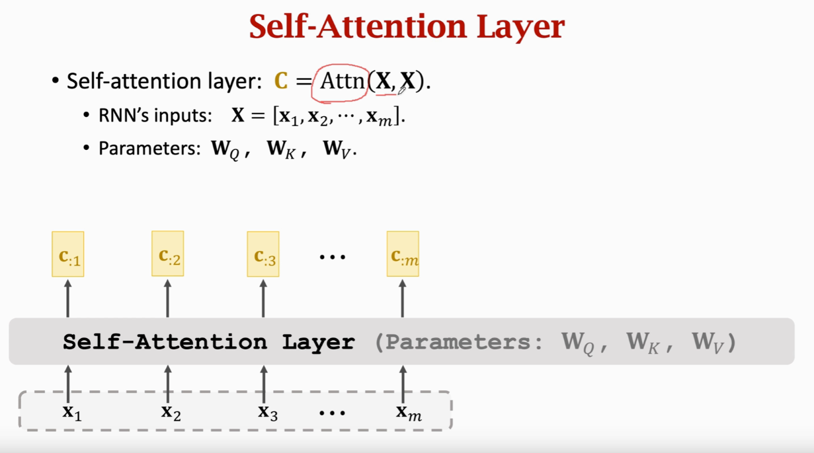
每个x被映射成q,k,v三个向量
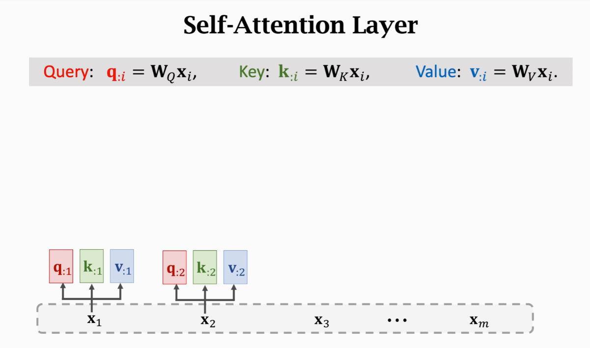
计算m个权重a(a是m维的)
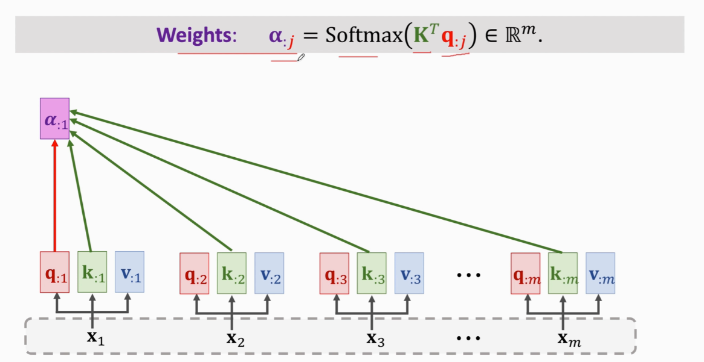

计算Context vector
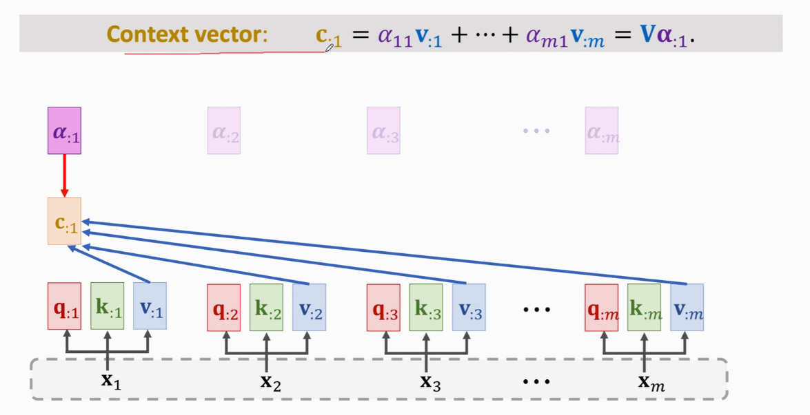
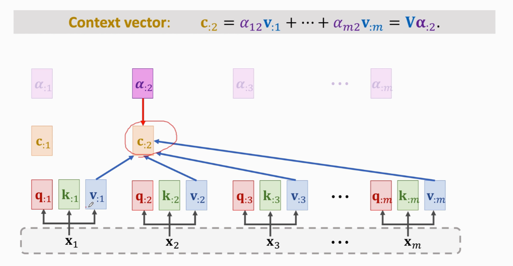
这m个c向量就是Self-Attention的输出
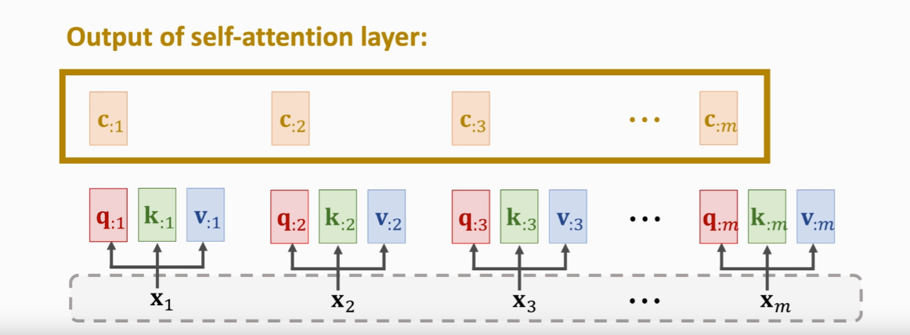
改变任何一个x输出c都会改变
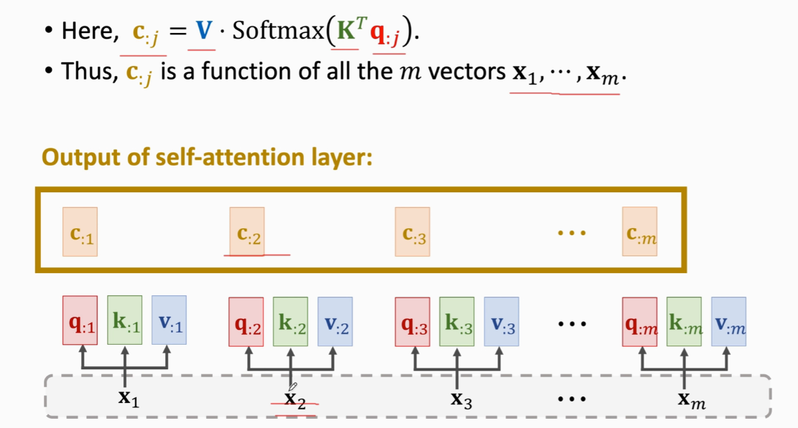
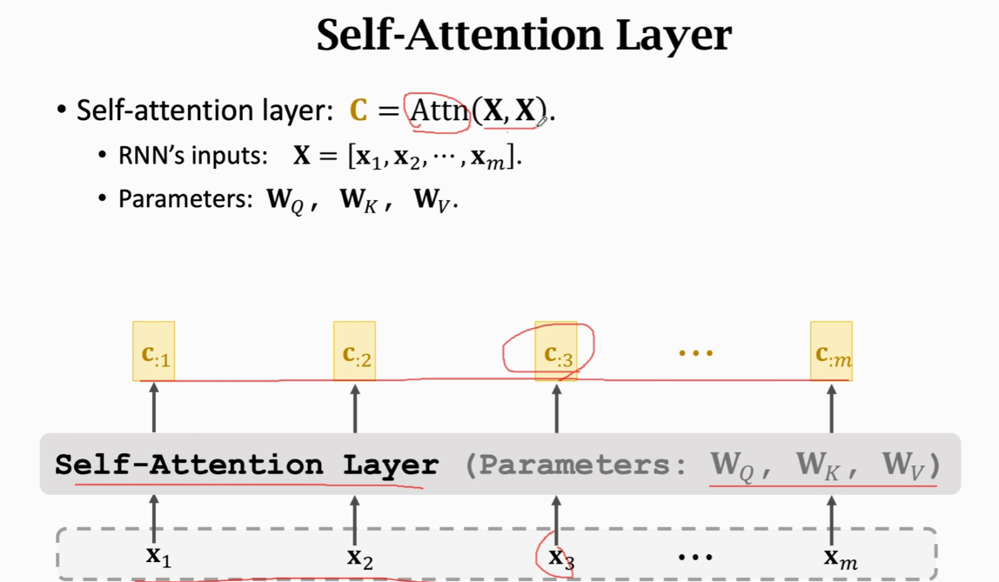
