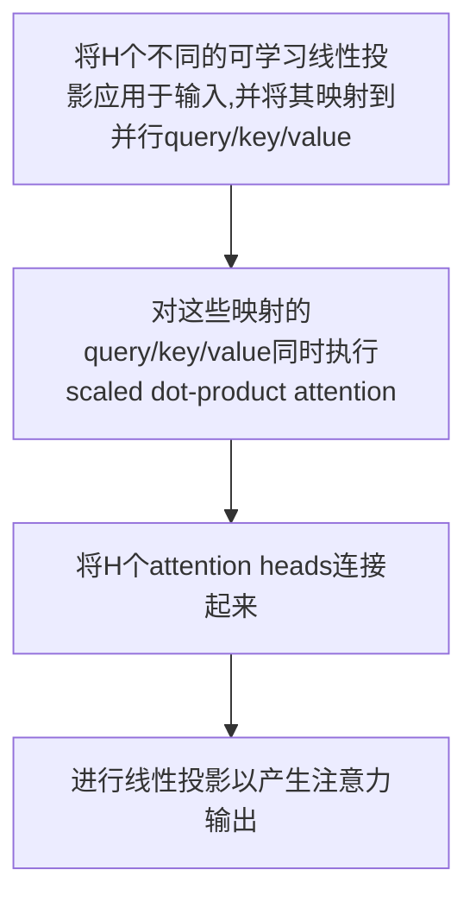

# 睡眠分期Transformer

| 论文名称 |Sleep Transformer: Automatic Sleep Staging With Interpretability and Uncertainty Quantification |
| -- | -- | 
| 期刊 |IEEE TRANSACTIONS ON BIOMEDICAL ENGINEERING 4.756/Q2|
| 方法 |(1)提出的睡眠transformer是一种基于transformer的Seq2Seq模型，在自动睡眠评分方面实现了最先进的性能。据我们所知，这是第一个完全依赖于为任务提出的transformer架构的Seq2Seq模型。(2)我们通过利用transformer的自注意力模块的注意力得分，以自然的方式在epoch和序列级别上解决睡眠分期模型的可解释性。(3)我们提出了一种基于熵的方法，将模型决策中的不确定性优雅地量化为一个具体数字。|
| 结论 |在大型数据库SHHS中，SleepTransformer的总体准确度为87.7%，κ为0.828。一方面，与原始序列对序列对应的SeqSleepNet相比，Sleep Transformer在准确度方面的绝对值提高了1.2%，在κ方面的绝对精度提高了0.017。该结果表明，变压器主干比SeqSleepNet中使用的循环主干更有优势。另一方面，SleepTransformer的性能与现有最先进的XSleepNets的性能相当,尽管它们的精度和κ之间的差异很小，但考虑到SleepTransformer仅使用时频输入（即单视图），具有较小的模型体积，且计算成本较低，这是相当可观的|
## 主要工作
- ==epoch level== 的 ==attention scores== 将用作应用于EEG信号输入的热图，以突出模型关注的特征。
-  ==sequence level== 的 ==attention scores== 被解释为不同相邻 epoch 对输入序列中目标 epoch 识别的影响。

- 建议使用模型输出的多类概率分布的 ==熵== 来精确量化其决策中的不确定性。

## 总体结构

## transformer
使用的transformer是encoder部分。它包括两个核心模块：multi-head attention和位置前馈网络(position-wise feed-forward network.)。

如图所示，在MultiHeadAttention模块中使用的注意力机制是==缩放点积注意力==。
它将输入序列不同位置的元素关联起来，以导出输出序列，该输出序列被计算为输入值的加权和，其中每个value的权重由attention机制公式query以及key决定。

MultiHeadAttention如图所示

所有这些步骤都可以公式化如下：
$$ \begin{aligned} \mathbf{Q}_{i}=\mathbf{Z} \mathbf{W}_{i}^{Q}, \mathbf{K}_{i} &=\mathbf{Z} \mathbf{W}_{i}^{K}, \mathbf{V}_{i}=\mathbf{Z} \mathbf{W}_{i}^{V}, 1 \leq i \leq H \\ \mathbf{H}_{i} &=\operatorname{Attention}\left(\mathbf{Q}_{i}, \mathbf{K}_{i}, \mathbf{V}_{i}\right) \\ &=\operatorname{softmax}\left(\frac{\mathbf{Q}_{i} \mathbf{K}_{i}^{\top}}{\sqrt{d}}\right) \mathbf{V}_{i} \\ \tilde{\mathbf{Z}} &=\operatorname{Concat}\left(\mathbf{H}_{1}, \ldots, \mathbf{H}_{H}\right) \mathbf{W}^{Z} \end{aligned} $$
位置前馈网络是完全连接的前馈网络。它由两个线性变换组成，中间有一个ReLU激活。除两个主要模块外，transformer还包括几个剩余模块以及normalization layers

$$ \begin{aligned} \tilde{\mathbf{Z}} &=\text { MultiHeadAttention }(\mathbf{Z}) \\ \mathbf{Z}_{m i d} &=\operatorname{LayerNorm}(\mathbf{Z}+\tilde{\mathbf{Z}}), \\ \mathbf{Z}_{F F} &=\operatorname{ReLU}\left(\mathbf{Z}_{\text {mid }} \mathbf{W}_{1}+\mathbf{b}_{1}\right) \mathbf{W}_{2}+\mathbf{b}_{2}, \\ \mathbf{O} &=\operatorname{LayerNorm}\left(\mathbf{Z}_{\text {mid }}+\mathbf{Z}_{F F}\right) . \end{aligned} $$

| 符号 | 含义 |
| -- | -- |
|$Z_{FF}$|表示位置前馈网络的输出|
|$W$|可学习的权重矩阵|
|$b$|可学习的和偏差|

## Epoch Transformer
将时频图像S视为T个sequence。
通过一堆Epoch Transformer对该序列进行编码。由于Transformer本身无法对顺序信息进行encoder，这对于Seq2Seq的睡眠评分网络中的epoch内和epoch间处理都至关重要，因此我们首先将位置编码(positional encodings)添加到输入以引入顺序信息：
$$ \tilde{\mathbf{S}}=\mathbf{S}+\mathbf{P}^{\mathrm{ep}} $$
$$ p_{i, 2 j}=\sin \left(\frac{i}{10000^{2 j / F}}\right) $$
$$ p_{i, 2 j+1}=\cos \left(\frac{i}{10000^{2 j / F}}\right) $$
$\tilde{\mathbf{S}}$的sequence可以表示为

$$ \mathbf{X}^{(i)}=\operatorname{EpochTransformer}\left(\mathbf{X}^{(i-1)}\right) $$

$x$表示输入epoch的导出特征向量。上式累加后:
$$ \mathbf{x}_{t}=\sum_{t=1}^{T} \alpha_{t} \mathbf{x}_{t}^{\left(N_{E}\right)} $$
α1，…，αT是==softmax attention layer==学习的注意力权重：
$$ \begin{aligned} \alpha_{t} &=\frac{\exp \left(\mathbf{a}_{t}^{\top} \mathbf{a}_{e}\right)}{\sum_{t=1}^{T} \exp \left(\mathbf{a}_{t}^{\top} \mathbf{a}_{e}\right)} \\ \mathbf{a}_{t} &=\tanh \left(\mathbf{W}_{a} \mathbf{x}_{t}+\mathbf{b}_{a}\right) \end{aligned} $$
W和b分别是可学习的权重矩阵和偏差。
$a_e$是可训练的epoch-level的上下文向量

## Sequence Transformer
通过Epoch Transformer输入序列（S1，…，SL）现在已转换为epoch特征向量序列（x1，…，xL）
生成的epoch特征向量（x1，…，xL）通常由==bi-RNN==处理，用于epoch间建模。这里，我们使用一堆SequenceTransformer来完成此目的。
与Epoch Transformer类似，位置编码首先通过正弦和余弦函数进行：
$$ \tilde{\mathbf{X}}=\mathbf{X}+\mathbf{P}^{\mathrm{seq}} $$
Pseq表示positional encoding

$$ \mathbf{O}^{(i)}=  SequenceTransformer  \left(\mathbf{O}^{(i-1)}\right) $$

最终呈现给具有ReLU激活的两个完全连接（FC）层，然后是softmax层以获得输出序列$\left(\hat{\mathbf{y}}_{1}, \ldots, \hat{\mathbf{y}}_{L}\right)$。SleepTransformer被训练以最小化序列上的==平均交叉熵损失==：

$$ \mathcal{L}=-\frac{1}{L} \sum_{i=1}^{L} \mathbf{y}_{i} \log \left(\hat{\mathbf{y}}_{i}\right) $$

## 可视化工具
可以利用注意力得分来解释模型。我们提出了两种不同的解释可视化方法：
- EEG注意热图，显示了模型在输入EEG信号中更关注的位置；
- 以条形图表示的epoch影响，该条形图限定了相邻epoch对预测输入序列中目标epoch睡眠阶段的贡献。

1） EEG注意力热图：为了了解模型的行为，了解模型更关注EEG输入的哪些部分是很重要的。为此，我们将EpochTransformer每个注意力头的注意力得分相加，以进行可视化。单个注意力头的注意力得分A为：
$$ \mathbf{A}=\operatorname{softmax}\left(\frac{\mathbf{Q}^{\top}}{\mathbf{K}} \sqrt{d}\right) $$
为了进一步深入了解网络学习的表示，我们使用注意力得分矩阵来变换时频输入，并在最后一个EpochTransformer之后获得时频输出，省略所有其他非线性操作。然后将短时傅立叶逆变换（ISTFT）应用于时频输出，以构建原始EEG信号，该原始EEG可以被可视化，以显示网络学习的特征。
2） epoch影响柱状图：为了进一步阐明模型的行为，在输入序列中对目标epoch进行评分时，了解模型更关注哪些相邻epoch同样重要。给定SequenceTransformer的注意力得分矩阵A，第i行和第j列的元素ai，j表示输入序列中的epochj在多大程度上归因于目标epochi的表示。我们认为，它与临床医生执行手动评分的方式非常相似。具体而言，当目标epoch没有显示出睡眠相关特征的大量证据时，将关注上下文中的相邻epoch，提供支持评分的证据。

## 基于熵的置信量化
在一般的多类分类问题中，深度神经网络输出一个向量，该向量的元素是概率，每个感兴趣的目标类一个。对于我们正在处理的5阶段睡眠阶段，SleepTransformer的输出$\hat y$由对应于C个睡眠阶段的C个概率值（在本例中为C=5）组成。通常，相对于最大概率的睡眠阶段被认为是网络的预测。

然而，预测的==离散标签==没有告诉我们网络对其决策有多大概率，而多类概率分布$\hat y$太复杂。

事实上，在$\hat y$中编码的睡眠阶段上的多类概率分布可以提供对网络预测的置信度的更精确的度量。在一个极端情况下，当$\hat y$将概率1分配给一个类，将概率0分配给其余类时，我们期望网络对其决策非常自信。在另一个极端中，当分布是平坦的，即$\hat y$中的所有元素都相等时，网络对其决策没有信心。所有其他分布表明这两个极端之间的置信水平不同。离散概率分布的熵作为不确定性的信息论度量，是测量网络内在不确定性的自然方法。反过来，网络的置信度可以量化为一个具体的数字。为此，我们建议使用归一化熵：
$$ H(\hat{\mathbf{y}})=-\sum_{c=1}^{C} \hat{y}_{c} \frac{\log \left(\hat{y}_{c}\right)}{\log C} $$
为了将不确定性范围归一化为[0，1]，假设0×log0=0。反过来，网络置信度被量化为
$$ \operatorname{Conf}(\hat{\mathbf{y}})=1-H(\hat{\mathbf{y}}) $$

## 时频图像的提取
如上所述，SleepTransformer摄取时频图像作为输入。为了提取时频图像，以100Hz采样的30秒EEGepoch被分解为两个具有50%重叠的第二帧，乘以汉明窗，并使用256点短时傅立叶变换（STFT）变换到频域。此过程产生图像S∈ T=29个时间帧，F=128个频率区间。值得注意的是，我们排除了第0个频率区间，以保持F=128，这是第IV-a节中epoch变换器中注意头数量的倍数。然后对振幅谱进行对数变换。给定使用训练数据计算的归一化参数，将从数据库提取的时频图像归一化为沿频率维度的零均值和单位方差。

## 训练
每100个训练步骤在验证集上验证模型,对模型进行了至少5000个验证步骤的训练。
| 名称 | 数值/方法 |
| -- | -- |
|Epoch Transformer数量|4|
|Sequence Transformer数量|4|
|Attention多头数量|8|
|前馈层的隐藏单元数量|1024|
|网络的FC层的大小|1024|
|模型评估|10倍交叉验证|
|优化器|adam optimizer+early stopping|
|dropout|0.1|
|损失函数|交叉熵函数|
|学习率|0.0001|
|β1|0.9|
|β2|0.999|
|训练batch size|32|

## 结果
### 模型比较
- 准确度
- kappa系数
- 宏观F1分数
- 平均灵敏度
- 平均特异性

在大型数据库SHHS中，SleepTransformer的总体准确度为87.7%，κ为0.828。一方面，与原始序列对序列对应的SeqSleepNet相比，Sleep Transformer在准确度方面的绝对值提高了1.2%，在κ方面的绝对精度提高了0.017。该结果表明，变压器主干比SeqSleepNet中使用的循环主干更有优势。另一方面，SleepTransformer的性能与现有最先进的XSleepNets的性能相当,尽管它们的精度和κ之间的差异很小，但考虑到SleepTransformer仅使用时频输入（即单视图），具有较小的模型体积，且计算成本较低，这是相当可观的.

可视化SleepEDF-78受试者2的估计置信度。（a）量化置信度；（b） 概率输出；（c） 输出催眠图，其中×表示错误分类的时期；（d）地面实况催眠图。阴影区域对应于置信度低于阈值的时期。

### 用于解释的注意力得分可视化
我们试图在epoch和序列水平上可视化两个不同输入序列的注意力得分。为了简单明了，我们使用了序列长度L=11的模型，最后一个EpochTransformer和SequenceTransformer的注意力得分分别用于EEG热图和序列级注意力。我们还包括序列中的预测标签、地面真相标签和epoch的估计置信度，以帮助解释。我们在附录中还显示了原始EEG信号的放大版本，以获取更多详细信息。

在epoch水平上，图中EEG信号的热图表明，该模型确实更关注睡眠相关特征。

此外，所构建的EEG类似于N1阶段的α波（c）中的第9、10和11期）、尾波阶段的高振幅神经活动（图7的第5、7和8期））、或N3阶段的δ波（图8的第1-6期）。这些构造的EEG表现出可区分的频率分布。

### Transformer块数

