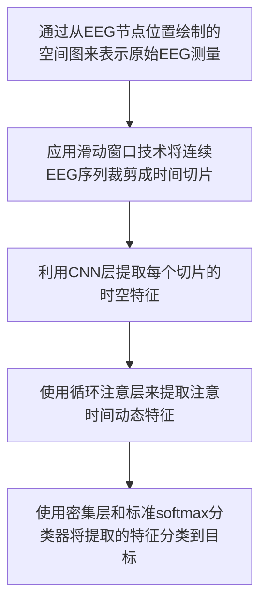

# 基于图形嵌入脑电信号Attention运动图像分类

| 论文名称 | Motor Imagery Classification via Temporal Attention Cues of Graph Embedded EEG Signals|
| -- | -- | 
| 期刊 |IEEE Journal of Biomedical and Health Informatics 7.021/Q1|
| 方法 |通过从EEG节点位置绘制的空间图来表示原始EEG测量,应用滑动窗口技术将连续EEG序列裁剪成时间切片,利用CNN层提取每个切片的时空特征,使用循环注意层来提取注意时间动态特征,使用密集层和标准softmax分类器将提取的特征分类到目标|
| 结论 |基于图论的这种嵌入很有创新的想法,但说实话效果并不让人满意,不过他的这种思路可以拓展到其他工作上去,他的CNN以及LSTM设计相对粗略,应该来说改进空间很大.|

---
## 主要工作
由于不同学科的大脑动力学波动很大，因此基于先验知识设计实用的手工特征很有挑战性。针对这一差距，本文提出了一种**基于图的卷积递归注意模型**(G-CRAM)，以探索不同受试者的脑电特征，用于运动图像分类。
- 首先开发了一种图结构来表示EEG节点的定位信息。
- 然后卷积重复注意模型从空间和时间维度学习EEG特征，并强调最可区分的时间周期。

该模型使用图嵌入来表示脑电空间信息，这与其他空间滤波方法不同，它与主题和任务无关。然后开发了一个递归注意模块，为不同的时间线索分配权重，而不是依赖于标准递归网络的累积时间信息；

## 传统脑电分析
依赖于`手工提取特征`和随后的`机器学习算法`。
::: tip PSD提取特征
==功率谱密度==(PSD)是最流行的手工提取特征方法之一。在分析运动图像EEG信号的PSD模式时，广泛观察到某些频带中EEG功率增加/减少的现象，称为**事件相关同步/去同步**(ERS/ERD)。同时，并非所有EEG节点都能提供PSD特征方面的可区分信息。EEG信道选择方法通常优选选择最具辨别力的EEG节点。C3、C4和Cz是三种常见的通道，对运动图像分类最有用。
:::
但是，使用手工提取特征存在一些缺点。
::: warning 缺陷
首先，以前的研究选择频带范围各不相同。例如，有的论文定义了mu频带是8-13 Hz之间的，而有的论文定义了在8-12 Hz之间。

其次，通过信道选择算法选择的有效EEG节点的数量通常由专家的知识和经验决定。第三，在这些传统工作中，所有步骤都是**分离**的，这是毫无意义的，不仅浪费时间，而且还**防止了不同步骤在特征学习过程中相互促进的可能性**。
:::
尽管强大的最先进分类器已用于手工提取特征，并实现了部分性能改进，但人类设计的特征不可能尽善尽美,总可能会忽略原始EEG信号中的关键信息。
## 更有前景的分析方式
而使用 **深度学习技术** 开发EEG分析方法，现阶段取得了不少有前景的结果:

- CNN证明了其在不同EEG范式上的成功。
- 为了有效地利用时间动态特性,采用长短时记忆(LSTM)单元的递归神经网络(RNN)。

## 基于图的卷积递归模型(G-CRAM)
### 概述
利用EEG节点的图表示有效地学习空间信息，并使用RNN with Attention网络提取时间信息。
### 步骤
::: tip 第一步
利用EEG节点的空间定位来形成EEG图，以明确地显示EEG节点连接的空间信息。与以往的空间滤波方法不同，所提出的图嵌入不依赖于主题或任务，因此对新主题更具鲁棒性。
::: 
::: tip 第二步
使用滑动窗口技术将EEG表示分割为多个连续的时间切片，并设计专门设计的CNN结构来学习EEG时间切片内的时空特征。
:::
::: tip 第三步
使用一个递归注意网络来获取不同EEG时间切片之间的时间相关性。在标准递归模块中，时间线索通常累积到最后一个时间步长，因此用于分类，以便省略早期时间步长中的一些关键信息。相反，所提出的模型为不同的时间线索分配权重，并为最终分类聚集所有信息。
:::

## 技术细节
### 实验数据
**蜂鸣器Beep** 和 **提示Cue** 用于通知和指示受试者执行运动图像任务。运动图像的持续时间T具有研究意义。

| 符号 | 含义 |
| -- | -- |
|$T$|兴趣的持续时长|
|$r_{i∈[1，n]}＝[s^i_1，s^i_2，…，s^i_k]∈ R_k$|n个EEG节点中的每一个传感器记录序列|
|$k=T×f$|表示时间点|
|$f$|采样频率|
|$s^i_t$|表示时间点T处第i个EEG传感器的测量值|
|$X_T=[r_1；r_2；…；r_n]∈R_k$|表示T试验的原始EEG特征的二维(2D)张量，一个维度表示EEG节点，另一个维度代表时间序列。|

### 模型结构

该模型是一个端到端框架，可以通过标准反向传播进行训练。

### 节点连接
::: tip EEG节点
EEG节点通常具有多个相邻节点来获取特定脑区域的EEG信号。因此，表示不同EEG节点之间的关系对于成功的EEG分析至关重要。
:::
利用EEG节点定位来形成EEG节点的==图形表示==，其中包括自然EEG节点连接的空间信息。构造了一个关于EEG节点定位的**无向空间图**$G=(V，E)$。**节点集** $V={s^i|i∈ [1，n]}$ 包括实验中的所有EEG节点。根据EEG节点邻接矩阵的结构，我们设计了三个EEG表示图：
- N-Graph(NG)
- D-Graph(DG)
- S-Graph(SG)。
::: warning 图嵌入的优势
图嵌入**增强**了EEG信号的脑区域表示能力，通过组合相邻节点来表示中心节点，**降低了噪声**对每个EEG节点的影响。该设计还通过在相邻节点的帮助下嵌入每个EEG节点，而不是仅依赖于自身的测量，使EEG表示对缺失值问题具有**鲁棒性**。
:::
#### 节点示意图

显示了64通道EEG节点的示例定位。在2D位置投影中，每个节点具有几个自然邻居(上、下、左、右、上左、上右、下左和下右)；
::: tip 例子
节点`s11`具有八个相邻节点$(s^{3}、s^{4}、s^{5}、s^{12}、s^{19}、s^{18}、s^{17}、s^{10})$。
:::
基于这一观察，我们在两个自然相邻的EEG节点之间建立了连接。形式上，边集可以表示为$Ev={s^{i}s^{j}|(i，j)∈ H}$ ，其中H是自然相邻EEG节点的集合。我们还将每个节点视为连接到自身。
### N-Graph
我们可以将N-Graph的邻接矩阵定义为平方矩阵$|V|×|V|$，其二进制元素表示两个EEG节点是否彼此相邻：

$$ A_{i j}=\left\{\begin{array}{ll}1 & \text { if } s^{i} s^{j} \in E_{v} \\ 0 & \text { else. } \end{array}\right.$$
然后，我们遵循谱图论对邻接矩阵进行归一化：
$$\hat{A}_{v}  =\widetilde{D}_{v}^{-\frac{1}{2}} \widetilde{A}_{v}\widetilde{D}_{v}^{-\frac{1}{2}} $$

---
**归一化公式:**
$$\widetilde{A}_{v}=A_{v}+I_{n} \\ \widetilde{D}_{v}=\operatorname{diag}\left(\sum_{j} A_{1 j}, \sum_{j} A_{2 j} \cdots \sum_{j} A_{|V| j}\right) $$

$$\widetilde{D}_{v}^{-\frac{1}{2}}=\operatorname{diag}\left(\frac{1}{\sqrt{\sum_{j} A_{1 j}}}, \frac{1}{\sqrt{\sum_{j} A_{2 j}}} \ldots \frac{1}{\sqrt{\sum_{j} A_{|V| j}}}\right) $$
---
则原始EEG信号的`N-Graph`表示为 $Z_v$ 是==归一化邻接矩阵== $\hat A_v$ 和 ==原始EEG试验== $X_T$ 的矩阵乘积：
$$ Z_{v}=\hat{A}_{v} X_{T}, Z_{v} \in \mathbb{R}^{n \times k} $$
### D-Graph
::: tip N-Graph缺点
N-Graph的邻接矩阵是一种**简单**的二进制嵌入，它**粗略**地表示空间信息，而不需要精确描述EEG节点的空间关系。而现实情况是那些**相对较远**的相邻节点的**影响较小**，而**相对较近**的相邻节点对中央节点的**影响较大**。
::: 
考虑到上述缺点，我们定义了一个**基于距离**的EEG图，称为D-Graph。D-Graph的邻接矩阵以两个相邻EEG节点之间的**距离**作为其元素。首先，我们将任意两个EEG节点之间的距离集定义为
$$ L=\left\{d_{i j} \mid\left(s^{i}, s^{j}\right) \in V^{2}, i \neq j\right\} $$
其中$d_{ij}$是节点$s^i$和$s^j$之间的欧氏距离。
::: tip 如何定义相邻节点
如果两个节点之间的距离小于距离集L的平均值，我们认为两个EEG节点是相邻的。
:::
::: tip 如何定义节点与自身之间的距离 
节点与自身之间的距离定义为其他相邻节点到该节点的平均距离。
:::
将邻接矩阵$A_d$的元素定义为：
$$ A_{i j}=\left\{\begin{array}{ll}\frac{1}{d_{i j}} & \text { if } d_{i j}<E(L) \\ 0 & \text { if } d_{i j} \geqslant E(L) \\ \frac{1}{E\left(\left\{d_{i q} \mid d_{i q}<E(L), q \in[1, n]\right\}\right)} & \text { if } i=j\end{array}\right. $$
其中$E(L)$是距离集L的平均值。**归一化公式与N-Graph相同**。
用`D-Graph`空间信息表示的原始EEG试验$X_T$为：
$$ Z_{d}=\hat{A}_{d} X_{T}, Z_{d} \in \mathbb{R}^{n \times k} $$

### S-Graph
把`D-Graph`中从节点的邻居到自身的**平均距离**，即$E(L)$
==修改为== 从节点的邻居到自身的**最短距离**。那么其邻接矩阵元素定义为：
$$ A_{i j}=\left\{\begin{array}{ll}\frac{1}{d_{i j}} & \text { if } d_{i j}<E(L) \\ 0 & \text { if } d_{i j} \geqslant E(L) \\ \frac{1}{\left.\operatorname{Min}\left(d_{i q} \mid q \in[1, n]\right\}\right)} & \text { if } i=j\end{array}\right. $$
`S-Graph`也以相同的方式进行归一化，以避免改变$X_T$的比例。S-Graph的最终表示为：
$$ Z_{s}=\hat{A}_{s} X_{T}, Z_{s} \in \mathbb{R}^{n \times k} . $$

::: tip 为什么要图形嵌入?
图形嵌入仅依赖于真实世界的节点布局，因此它独立于主题、目标任务和手动设置的参数。因此，它是对以下神经网络的补充，这是一种数据驱动的特征学习方法。
:::

## CNN部分
在嵌入原始EEG信号后，应用滑动窗口将EEG表示沿时间维度切割成若干时间切片$Qi∈ R^{n×w}$，其中$w$是时间切片长度。设两个相邻切片之间的间隔为$p$，则m个切片从一个EEG试验获得。
$$m=int((k− w) /p)$$ 
$$ U_{i}=\operatorname{Conv}\left(Q_{i}\right), i \in[1, m] $$
$$ S_{i}=\operatorname{Max} \operatorname{Pool}\left(U_{i}\right), i \in[1, m] $$

| 结构 | 大小 |
| -- | -- |
|CNN层|1|
|池化层|1|
|CNN核高度|n|
|核的宽度|45|
|CNN滤波器的输出量|40|
|激活函数|ELU|

## LSTM部分
LSTM单元用于构建两个堆叠的RNN层。在**平坦化**先前时空编码的输出之后，获得m个1D矢量并将其输入到RNN中。因此，每个RNN层具有m个LSTM细胞.
$$ \left\{h_{i}^{\prime} \in \mathbb{R}^{l} \mid h_{i}^{\prime}=\operatorname{LSTM}\left(S_{i}\right), i=1 \ldots m\right\} $$
## Self-Attention部分

每个切片表示$h_{i}^{\prime}$首先被非线性变换为潜在空间：

$$ H_{i}=\tanh \left(W_{i} h_{i}^{\prime}+b_{i}\right), H_{i} \in \mathbb{R}^{h_{a}} $$

应用于非线性潜在表示$H_i$以获得每个切片的重要性权重：

$$ V_{i}=\frac{\exp \left(H_{i}^{\top} v_{i}\right)}{\sum_{i} \exp \left(H_{i}^{\top} v_{i}\right)} $$

该权重矩阵将集中于比其他更可区分的特定时间切片。最后，为了计算效率，将所有EEG时间切片的加权和计算为切片聚焦表示：
$$ A=\sum_{i} V_{i} h_{i}^{\prime}, A \in \mathbb{R}^{l} $$
注意力时间动态表示A被馈送到标准softmax分类器中：
$$ P=\operatorname{softmax}(W A+b) $$
softmax函数的作用是：确保所有计算的权重总和为1，定义为
$$ \operatorname{softmax}\left(x_{i}\right)=\frac{1}{\mathcal{Z}} \exp \left(x_{i}\right) $$
$$
\mathcal{Z}=\sum_{i} \exp \left(x_{i}\right)
$$
其中$W$和$b$分别是运动图像分类层的权重和偏差矩阵。然后评估所有标记样本上的交叉熵误差：
$$ \mathcal{L}=-\sum_{c} \hat{Y}_{c} \log \left(P_{c}\right) $$
其中$\hat Y_c$和$P_c$分别是运动图像策略c的标签和分类概率。网络权重和偏差采用批量梯度下降法进行训练。最终分类结果定义为具有最大分类概率的运动图像策略。

## 训练

| 名称 | 数值/方法 |
| -- | -- |
|模型评估|10倍交叉验证|
|优化器|随机梯度下降+adam optimizer+early stopping|
|dropout|0.5|
|损失函数|交叉熵函数|
|学习率|0.0001|
|LSTM中隐藏状态的维度|64|
|Self Attention非线性变换大小|512|
|超参数|16|
|可训练参数|420356|
## 结果
### 分类精度

### 头皮地形图可视化

### LSTM的有无对attention权重与最后精度的影响

